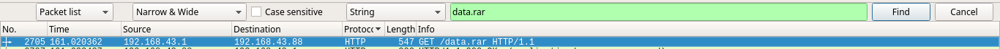
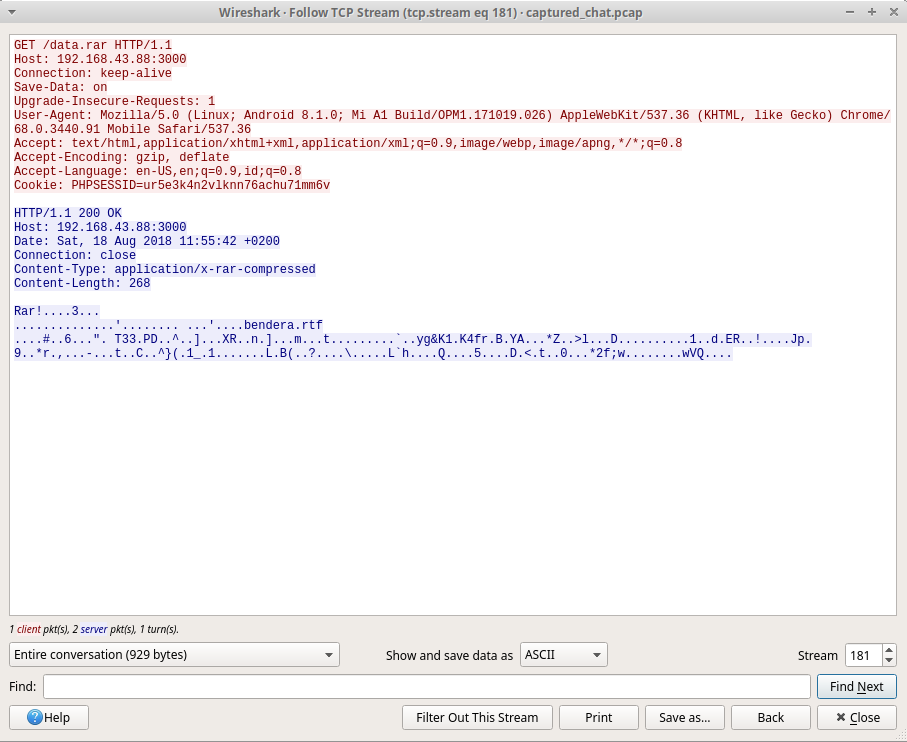
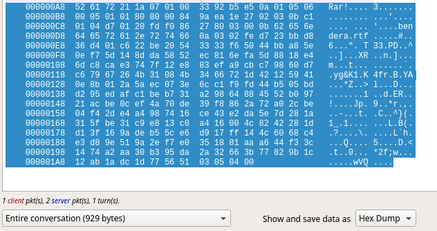
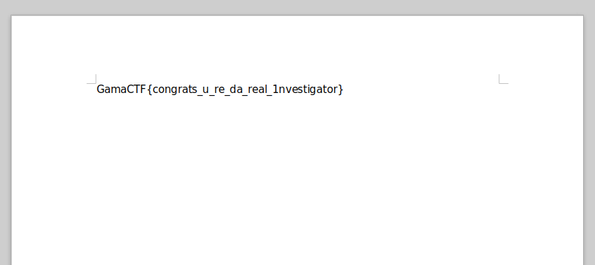

# __ASGama CTF__ 
## _Investigasi86_

## Information
**Category:** | **Points:** | **Writeup Author**
--- | --- | ---
Forensics | 100 | l0l

**Description:** 

> Hai kamu, iya kamu !!! Kemarin malam kami mendapat laporan bahwa terdapat agen mata-mata yang menyusup kedalam server pemerintahan pusat dan mencuri data penting. Untungnya sistem kami dapat merekam aktifitas mereka. Akan tetapi kami masih belum dapat mengetahui jenis data yang dicuri, oleh karena itu kami meminta bantuanmu untuk mencari tahu jenis data apakah yang dicuri agar kami bisa bertindak cepat demi kedaulatan NKRI.
>
> Dirgahayu Republik Indonesia yang ke-73, Merdeka !!!
>
> [captured_chat](./captured_chat.pcap)

### Investigasi86  
```
$ file captured_chat.pcap 
captured_chat.pcap: tcpdump capture file (little-endian) - version 2.4 (Ethernet, capture length 65535)
```

Langsung buka dengan wireshark.

Telusuri manual, sedikit-demi sedikit. Akhirnya ketemu sebuah record yang menarik.


Coba `Follow TCP Stream`

```html
GET /chat.php?_=1534586001633 HTTP/1.1
Host: 192.168.43.88:3000
Connection: keep-alive
Accept: */*
X-Requested-With: XMLHttpRequest
Save-Data: on
User-Agent: Mozilla/5.0 (Linux; Android 8.1.0; Mi A1 Build/OPM1.171019.026) AppleWebKit/537.36 (KHTML, like Gecko) Chrome/68.0.3440.91 Mobile Safari/537.36
Referer: http://192.168.43.88:3000/index.php
Accept-Encoding: gzip, deflate
Accept-Language: en-US,en;q=0.9,id;q=0.8
Cookie: PHPSESSID=luq8buc2porn86bk4epqtfgpik

HTTP/1.1 200 OK
Host: 192.168.43.88:3000
Date: Sat, 18 Aug 2018 11:56:03 +0200
Connection: close
X-Powered-By: PHP/7.1.8
Expires: Thu, 19 Nov 1981 08:52:00 GMT
Cache-Control: no-store, no-cache, must-revalidate
Pragma: no-cache
Content-type: text/html; charset=UTF-8

<p>*baka_agent: halo agen hibiki<p><p>*hibiki_agent: halo juga agen baka<p><p>*baka_agent: jadi, bagaimana hasilnya? berikan saya data<p><p>*hibiki_agent: oke siap agen baka<p><p>*hibiki_agent: uploading data<p><p>*hibiki_agent: ini dia datanya http://192.168.43.88:3000/data.rar<p><p>*baka_agent: oke terima kasib agen hibiki, akan saya download<p><p>*baka_agent: oke sudah saya download, kerja bagus agen hibiki<p>
```

Dari chat ini kita tahu bawha ada data dalam bentuk rar yang dikirim, yaitu `data.rar`. Maka lakukan pencarian terhadap string `data.rar`.  


Kemudian `Follow TCP Stream`  


Binary file nya ikut terekam, jadi kita dapat mengambil file `data.rar` juga. Disini saya masuk ke mode view hex di wireshark. lalu saya copy bagian `data.rar` lalu save ke sebuah file.  


Saya copy dan masukkan ke sebuah file. Ketika akan direverse dengan `xxd -r` ternyata tidak berhasil, data yang dihasilkan tidak terbaca sebagai rar. Maka saya buat file script untuk write binary secara manual dari hex.

### Payload
```py
f = open("data.rar","wb")

data = map(lambda x: x.decode('hex'),"""52 61 72 21 1a 07 01 00  33 92 b5 e5 0a 01 05 06
00 05 01 01 80 80 00 84  9a ea 1e 27 02 03 0b c1
01 04 d7 01 20 fd f0 86  27 80 03 00 0b 62 65 6e
64 65 72 61 2e 72 74 66  0a 03 02 fe d7 23 bb d8
36 d4 01 c6 22 be 20 54  33 33 f6 50 44 bb a8 5e
0e f7 5d 14 8d da 58 52  ec 81 6e fa 5d 88 18 e4
6d c8 ca e3 74 7f 12 e8  83 ef a9 cb c7 98 60 d7
c6 79 67 26 4b 31 08 4b  34 66 72 1d 42 12 59 41
0e 8b 01 2a 5a ec 07 3e  6c c1 f9 fd 44 b5 05 bd
d2 95 ed af c1 be b7 31  a2 98 64 88 45 52 b0 97
21 ac be 0c ef 4a 70 de  39 f8 86 2a 72 a0 2c be
04 f4 2d e4 a4 98 74 16  ce 43 e2 da 5e 7d 28 1a
31 5f be 31 c9 e8 13 c0  a4 16 00 4c 82 42 28 1d
d1 3f 16 9a de b5 5c e6  d9 17 ff 14 4c 60 68 c4
e3 d8 9e 51 9a 2e f7 e0  35 18 81 aa a6 44 f3 3c
14 74 a2 aa 30 b3 95 da  2a 32 66 3b 77 82 9b 1c
12 ab 1a dc 1d 77 56 51  03 05 04 00""".replace('\n',' ').split(" "))

f.write(''.join(data))
f.close()
```

Setelah itu cek hasilnya  
```
$ file data.rar 
data.rar: RAR archive data, v5


$ unrar e data.rar 

UNRAR 5.50 freeware      Copyright (c) 1993-2017 Alexander Roshal


Extracting from data.rar

Extracting  bendera.rtf                                               OK 
All OK

```

Kita dapatkan file `bendera.rtf`

### Result


### Flag
GamaCTF{congrats_u_re_da_real_1nvestigator}