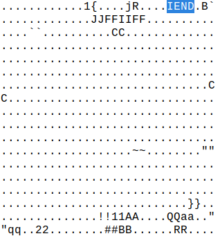
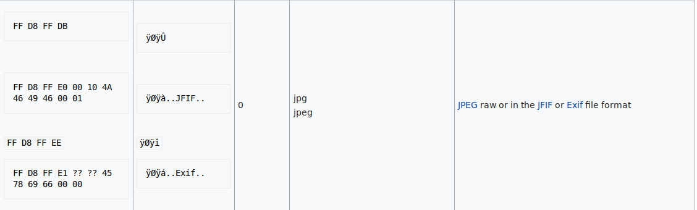
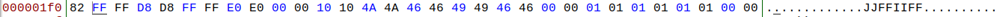

# __ASGama CTF__ 
## _Stackable_

## Information
**Category:** | **Points:** | **Writeup Author**
--- | --- | ---
Forensics | 50 | l0l

**Description:** 

> format flag CTF{}
>
> [Stackable](./soal3.jpg)

### Stackable
Coba analisis dengan exiftool:  
```
ExifTool Version Number         : 10.80
File Name                       : soal3.png
Directory                       : .
File Size                       : 32 kB
File Modification Date/Time     : 2018:12:30 05:52:45+07:00
File Access Date/Time           : 2018:12:30 05:52:55+07:00
File Inode Change Date/Time     : 2018:12:30 05:52:45+07:00
File Permissions                : rw-rw-r--
File Type                       : PNG
File Type Extension             : png
MIME Type                       : image/png
Image Width                     : 370
Image Height                    : 370
Bit Depth                       : 1
Color Type                      : Grayscale
Compression                     : Deflate/Inflate
Filter                          : Adaptive
Interlace                       : Noninterlaced
Warning                         : [minor] Trailer data after PNG IEND chunk
Image Size                      : 370x370
Megapixels                      : 0.137
```

Terdapat `Warning` : `[minor] Trailer data after PNG IEND chunk`. Coba buka dengan bless untuk melihat data apa yang ada setelah IEND chunk



Ternyata terdapat header untuk gambar (terlihat dari `JFIF`) tapi berulang. Kemungkinan ada 2 gambar yang di write secara bergantian dalam gambar utama.



Seperti yang terlihat, file baru dimulai dengan hex `FF D8 FF E0 00 10 4A 46 49 46 00 01`. Maka cari offset dari header tersebut di dalam file.  


Terlihat offset nya adalah 0x1f1. Sekarang kita coba extract gambar dari gambar utama dengan script python.

### Payload
```py
data = open("soal3.png","rb").read()[0x1f1:]


gambar1 = open("gambar1","wb")
gambar2 = open("gambar2","wb")

data1=""
data2=""

for i,j in zip(data[::2],data[1::2]):
    data1+=i
    data2+=j

# kalo pake yang bawah hasilnya gakebaca
"""
for i in range(0,len(data)/2,2):
    data1+=data[i]
    data2+=data[i+1]

"""

gambar1.write(data1)
gambar2.write(data2)

gambar1.close()
gambar2.close()
```

### Result


### Flag
CTF{Gg_3z_f1l3_c4rv1ng}