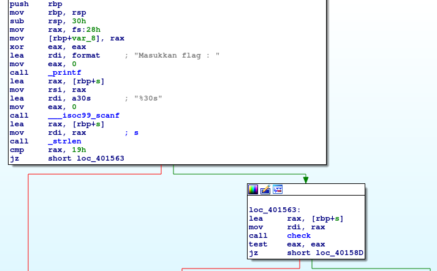
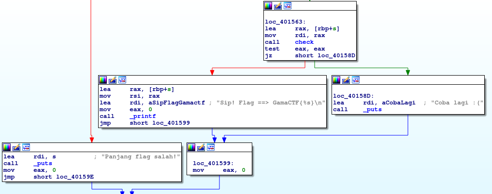
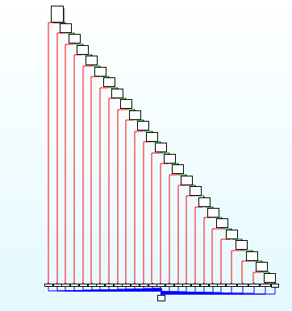

# __ASGama CTF__ 
## _Matematika_

## Information
**Category:** | **Points:** | **Writeup Author**
--- | --- | ---
Reverse Engineering | 200 | l0l

**Description:** 

> Hanya penjumlahan dan perkalian :)
>
> [Matematika](./Matematika)


### Matematika

#### file
```
$ file Matematika 
Matematika: ELF 64-bit LSB executable, x86-64, version 1 (SYSV), dynamically linked, interpreter /lib64/ld-linux-x86-64.so.2, for GNU/Linux 3.2.0, BuildID[sha1]=d331e42491be6746bff4e8faf5eb79d7bf3394e1, not stripped
```

Langsung coba disassemble dengan ida.

#### main
  


Pada fungsi main ini program meminta input lalu menghitung panjangnya. Bandingkan panjang input dengan 0x19, jika sama masuk ke fungsi `check` jika tidak berarti input salah.

#### check
Fungsi check ini cukup panjang, dan sangat jelek jika didisassemble dengan ida :  


Maka saya buka dengan gdb

```
Dump of assembler code for function check:
   0x0000000000401162 <+0>:	push   rbp
   0x0000000000401163 <+1>:	mov    rbp,rsp
   0x0000000000401166 <+4>:	mov    QWORD PTR [rbp-0x8],rdi
   0x000000000040116a <+8>:	mov    rax,QWORD PTR [rbp-0x8]
   0x000000000040116e <+12>:	movzx  eax,BYTE PTR [rax]
   0x0000000000401171 <+15>:	movsx  eax,al
   0x0000000000401174 <+18>:	add    eax,0x28
   0x0000000000401177 <+21>:	imul   eax,eax,0x6b
   0x000000000040117a <+24>:	cmp    eax,0x4134
   0x000000000040117f <+29>:	je     0x40118b <check+41>
   0x0000000000401181 <+31>:	mov    eax,0x0
   0x0000000000401186 <+36>:	jmp    0x4014fc <check+922>
   0x000000000040118b <+41>:	mov    rax,QWORD PTR [rbp-0x8]
   0x000000000040118f <+45>:	add    rax,0x1
   0x0000000000401193 <+49>:	movzx  eax,BYTE PTR [rax]
   0x0000000000401196 <+52>:	movsx  eax,al
   0x0000000000401199 <+55>:	add    eax,0x67
   0x000000000040119c <+58>:	imul   eax,eax,0x65
   0x000000000040119f <+61>:	cmp    eax,0x3d27
   0x00000000004011a4 <+66>:	je     0x4011b0 <check+78>
   0x00000000004011a6 <+68>:	mov    eax,0x0
   0x00000000004011ab <+73>:	jmp    0x4014fc <check+922>
   0x00000000004011b0 <+78>:	mov    rax,QWORD PTR [rbp-0x8]
   0x00000000004011b4 <+82>:	add    rax,0x2
   0x00000000004011b8 <+86>:	movzx  eax,BYTE PTR [rax]
   0x00000000004011bb <+89>:	movsx  eax,al
   0x00000000004011be <+92>:	add    eax,0x61
   0x00000000004011c1 <+95>:	imul   eax,eax,0x74
   0x00000000004011c4 <+98>:	cmp    eax,0x5d58
   0x00000000004011c9 <+103>:	je     0x4011d5 <check+115>
   0x00000000004011cb <+105>:	mov    eax,0x0
   0x00000000004011d0 <+110>:	jmp    0x4014fc <check+922>
   0x00000000004011d5 <+115>:	mov    rax,QWORD PTR [rbp-0x8]
   0x00000000004011d9 <+119>:	add    rax,0x3
   0x00000000004011dd <+123>:	movzx  eax,BYTE PTR [rax]
   0x00000000004011e0 <+126>:	movsx  eax,al
   0x00000000004011e3 <+129>:	add    eax,0x6b
   0x00000000004011e6 <+132>:	imul   eax,eax,0x65
   0x00000000004011e9 <+135>:	cmp    eax,0x3d8c
   0x00000000004011ee <+140>:	je     0x4011fa <check+152>
   0x00000000004011f0 <+142>:	mov    eax,0x0
   0x00000000004011f5 <+147>:	jmp    0x4014fc <check+922>
   0x00000000004011fa <+152>:	mov    rax,QWORD PTR [rbp-0x8]
   0x00000000004011fe <+156>:	add    rax,0x4
   0x0000000000401202 <+160>:	movzx  eax,BYTE PTR [rax]
   0x0000000000401205 <+163>:	movsx  eax,al
   0x0000000000401208 <+166>:	add    eax,0x20
   0x000000000040120b <+169>:	imul   eax,eax,0x6d
   0x000000000040120e <+172>:	cmp    eax,0x2357
   0x0000000000401213 <+177>:	je     0x40121f <check+189>
   0x0000000000401215 <+179>:	mov    eax,0x0
   0x000000000040121a <+184>:	jmp    0x4014fc <check+922>
   0x000000000040121f <+189>:	mov    rax,QWORD PTR [rbp-0x8]
   0x0000000000401223 <+193>:	add    rax,0x5
   0x0000000000401227 <+197>:	movzx  eax,BYTE PTR [rax]
   0x000000000040122a <+200>:	movsx  eax,al
   0x000000000040122d <+203>:	add    eax,0x6e
   0x0000000000401230 <+206>:	imul   eax,eax,0x75
   0x0000000000401233 <+209>:	cmp    eax,0x5e9b
   0x0000000000401238 <+214>:	je     0x401244 <check+226>
   0x000000000040123a <+216>:	mov    eax,0x0
   0x000000000040123f <+221>:	jmp    0x4014fc <check+922>
   0x0000000000401244 <+226>:	mov    rax,QWORD PTR [rbp-0x8]
   0x0000000000401248 <+230>:	add    rax,0x6
   0x000000000040124c <+234>:	movzx  eax,BYTE PTR [rax]
   0x000000000040124f <+237>:	movsx  eax,al
   0x0000000000401252 <+240>:	add    eax,0x61
   0x0000000000401255 <+243>:	shl    eax,0x5
   0x0000000000401258 <+246>:	cmp    eax,0x1520
   0x000000000040125d <+251>:	je     0x401269 <check+263>
   0x000000000040125f <+253>:	mov    eax,0x0
   0x0000000000401264 <+258>:	jmp    0x4014fc <check+922>
   0x0000000000401269 <+263>:	mov    rax,QWORD PTR [rbp-0x8]
   0x000000000040126d <+267>:	add    rax,0x7
   0x0000000000401271 <+271>:	movzx  eax,BYTE PTR [rax]
   0x0000000000401274 <+274>:	movsx  eax,al
   0x0000000000401277 <+277>:	add    eax,0x6d
   0x000000000040127a <+280>:	imul   eax,eax,0x70
   0x000000000040127d <+283>:	cmp    eax,0x5940
   0x0000000000401282 <+288>:	je     0x40128e <check+300>
   0x0000000000401284 <+290>:	mov    eax,0x0
   0x0000000000401289 <+295>:	jmp    0x4014fc <check+922>
   0x000000000040128e <+300>:	mov    rax,QWORD PTR [rbp-0x8]
   0x0000000000401292 <+304>:	add    rax,0x8
   0x0000000000401296 <+308>:	movzx  eax,BYTE PTR [rax]
   0x0000000000401299 <+311>:	movsx  eax,al
   0x000000000040129c <+314>:	add    eax,0x62
   0x000000000040129f <+317>:	imul   eax,eax,0x65
   0x00000000004012a2 <+320>:	cmp    eax,0x4441
   0x00000000004012a7 <+325>:	je     0x4012b3 <check+337>
   0x00000000004012a9 <+327>:	mov    eax,0x0
   0x00000000004012ae <+332>:	jmp    0x4014fc <check+922>
   0x00000000004012b3 <+337>:	mov    rax,QWORD PTR [rbp-0x8]
   0x00000000004012b7 <+341>:	add    rax,0x9
   0x00000000004012bb <+345>:	movzx  eax,BYTE PTR [rax]
   0x00000000004012be <+348>:	movsx  eax,al
   0x00000000004012c1 <+351>:	add    eax,0x61
   0x00000000004012c4 <+354>:	imul   eax,eax,0x73
   0x00000000004012c7 <+357>:	cmp    eax,0x42ef
   0x00000000004012cc <+362>:	je     0x4012d8 <check+374>
   0x00000000004012ce <+364>:	mov    eax,0x0
   0x00000000004012d3 <+369>:	jmp    0x4014fc <check+922>
   0x00000000004012d8 <+374>:	mov    rax,QWORD PTR [rbp-0x8]
   0x00000000004012dc <+378>:	add    rax,0xa
   0x00000000004012e0 <+382>:	movzx  eax,BYTE PTR [rax]
   0x00000000004012e3 <+385>:	movsx  eax,al
   0x00000000004012e6 <+388>:	add    eax,0x68
   0x00000000004012e9 <+391>:	imul   eax,eax,0x61
   0x00000000004012ec <+394>:	cmp    eax,0x4434
   0x00000000004012f1 <+399>:	je     0x4012fd <check+411>
   0x00000000004012f3 <+401>:	mov    eax,0x0
   0x00000000004012f8 <+406>:	jmp    0x4014fc <check+922>
   0x00000000004012fd <+411>:	mov    rax,QWORD PTR [rbp-0x8]
   0x0000000000401301 <+415>:	add    rax,0xb
   0x0000000000401305 <+419>:	movzx  eax,BYTE PTR [rax]
   0x0000000000401308 <+422>:	movsx  eax,al
   0x000000000040130b <+425>:	add    eax,0x20
   0x000000000040130e <+428>:	imul   eax,eax,0x6e
   0x0000000000401311 <+431>:	cmp    eax,0x22ce
   0x0000000000401316 <+436>:	je     0x401322 <check+448>
   0x0000000000401318 <+438>:	mov    eax,0x0
   0x000000000040131d <+443>:	jmp    0x4014fc <check+922>
   0x0000000000401322 <+448>:	mov    rax,QWORD PTR [rbp-0x8]
   0x0000000000401326 <+452>:	add    rax,0xc
   0x000000000040132a <+456>:	movzx  eax,BYTE PTR [rax]
   0x000000000040132d <+459>:	movsx  eax,al
   0x0000000000401330 <+462>:	add    eax,0x70
   0x0000000000401333 <+465>:	shl    eax,0x5
   0x0000000000401336 <+468>:	cmp    eax,0x19e0
   0x000000000040133b <+473>:	je     0x401347 <check+485>
   0x000000000040133d <+475>:	mov    eax,0x0
   0x0000000000401342 <+480>:	jmp    0x4014fc <check+922>
   0x0000000000401347 <+485>:	mov    rax,QWORD PTR [rbp-0x8]
   0x000000000040134b <+489>:	add    rax,0xd
   0x000000000040134f <+493>:	movzx  eax,BYTE PTR [rax]
   0x0000000000401352 <+496>:	movsx  eax,al
   0x0000000000401355 <+499>:	add    eax,0x6f
   0x0000000000401358 <+502>:	imul   eax,eax,0x72
   0x000000000040135b <+505>:	cmp    eax,0x5bbc
   0x0000000000401360 <+510>:	je     0x40136c <check+522>
   0x0000000000401362 <+512>:	mov    eax,0x0
   0x0000000000401367 <+517>:	jmp    0x4014fc <check+922>
   0x000000000040136c <+522>:	mov    rax,QWORD PTR [rbp-0x8]
   0x0000000000401370 <+526>:	add    rax,0xe
   0x0000000000401374 <+530>:	movzx  eax,BYTE PTR [rax]
   0x0000000000401377 <+533>:	movsx  eax,al
   0x000000000040137a <+536>:	add    eax,0x69
   0x000000000040137d <+539>:	imul   eax,eax,0x61
   0x0000000000401380 <+542>:	cmp    eax,0x4434
   0x0000000000401385 <+547>:	je     0x401391 <check+559>
   0x0000000000401387 <+549>:	mov    eax,0x0
   0x000000000040138c <+554>:	jmp    0x4014fc <check+922>
   0x0000000000401391 <+559>:	mov    rax,QWORD PTR [rbp-0x8]
   0x0000000000401395 <+563>:	add    rax,0xf
   0x0000000000401399 <+567>:	movzx  eax,BYTE PTR [rax]
   0x000000000040139c <+570>:	movsx  eax,al
   0x000000000040139f <+573>:	add    eax,0x6e
   0x00000000004013a2 <+576>:	imul   eax,eax,0x68
   0x00000000004013a5 <+579>:	cmp    eax,0x5c38
   0x00000000004013aa <+584>:	je     0x4013b6 <check+596>
   0x00000000004013ac <+586>:	mov    eax,0x0
   0x00000000004013b1 <+591>:	jmp    0x4014fc <check+922>
   0x00000000004013b6 <+596>:	mov    rax,QWORD PTR [rbp-0x8]
   0x00000000004013ba <+600>:	add    rax,0x10
   0x00000000004013be <+604>:	movzx  eax,BYTE PTR [rax]
   0x00000000004013c1 <+607>:	movsx  eax,al
   0x00000000004013c4 <+610>:	add    eax,0x74
   0x00000000004013c7 <+613>:	imul   eax,eax,0x61
   0x00000000004013ca <+616>:	cmp    eax,0x5726
   0x00000000004013cf <+621>:	je     0x4013db <check+633>
   0x00000000004013d1 <+623>:	mov    eax,0x0
   0x00000000004013d6 <+628>:	jmp    0x4014fc <check+922>
   0x00000000004013db <+633>:	mov    rax,QWORD PTR [rbp-0x8]
   0x00000000004013df <+637>:	add    rax,0x11
   0x00000000004013e3 <+641>:	movzx  eax,BYTE PTR [rax]
   0x00000000004013e6 <+644>:	movsx  eax,al
   0x00000000004013e9 <+647>:	add    eax,0x20
   0x00000000004013ec <+650>:	imul   eax,eax,0x73
   0x00000000004013ef <+653>:	cmp    eax,0x25bc
   0x00000000004013f4 <+658>:	je     0x401400 <check+670>
   0x00000000004013f6 <+660>:	mov    eax,0x0
   0x00000000004013fb <+665>:	jmp    0x4014fc <check+922>
   0x0000000000401400 <+670>:	mov    rax,QWORD PTR [rbp-0x8]
   0x0000000000401404 <+674>:	add    rax,0x12
   0x0000000000401408 <+678>:	movzx  eax,BYTE PTR [rax]
   0x000000000040140b <+681>:	movsx  eax,al
   0x000000000040140e <+684>:	add    eax,0x79
   0x0000000000401411 <+687>:	imul   eax,eax,0x69
   0x0000000000401414 <+690>:	cmp    eax,0x5ebf
   0x0000000000401419 <+695>:	je     0x401425 <check+707>
   0x000000000040141b <+697>:	mov    eax,0x0
   0x0000000000401420 <+702>:	jmp    0x4014fc <check+922>
   0x0000000000401425 <+707>:	mov    rax,QWORD PTR [rbp-0x8]
   0x0000000000401429 <+711>:	add    rax,0x13
   0x000000000040142d <+715>:	movzx  eax,BYTE PTR [rax]
   0x0000000000401430 <+718>:	movsx  eax,al
   0x0000000000401433 <+721>:	add    eax,0x61
   0x0000000000401436 <+724>:	imul   eax,eax,0x61
   0x0000000000401439 <+727>:	cmp    eax,0x3937
   0x000000000040143e <+732>:	je     0x40144a <check+744>
   0x0000000000401440 <+734>:	mov    eax,0x0
   0x0000000000401445 <+739>:	jmp    0x4014fc <check+922>
   0x000000000040144a <+744>:	mov    rax,QWORD PTR [rbp-0x8]
   0x000000000040144e <+748>:	add    rax,0x14
   0x0000000000401452 <+752>:	movzx  eax,BYTE PTR [rax]
   0x0000000000401455 <+755>:	movsx  eax,al
   0x0000000000401458 <+758>:	add    eax,0x61
   0x000000000040145b <+761>:	shl    eax,0x5
   0x000000000040145e <+764>:	cmp    eax,0x1800
   0x0000000000401463 <+769>:	je     0x40146f <check+781>
   0x0000000000401465 <+771>:	mov    eax,0x0
   0x000000000040146a <+776>:	jmp    0x4014fc <check+922>
   0x000000000040146f <+781>:	mov    rax,QWORD PTR [rbp-0x8]
   0x0000000000401473 <+785>:	add    rax,0x15
   0x0000000000401477 <+789>:	movzx  eax,BYTE PTR [rax]
   0x000000000040147a <+792>:	movsx  eax,al
   0x000000000040147d <+795>:	add    eax,0x20
   0x0000000000401480 <+798>:	imul   eax,eax,0x6e
   0x0000000000401483 <+801>:	cmp    eax,0x2a1c
   0x0000000000401488 <+806>:	je     0x401491 <check+815>
   0x000000000040148a <+808>:	mov    eax,0x0
   0x000000000040148f <+813>:	jmp    0x4014fc <check+922>
   0x0000000000401491 <+815>:	mov    rax,QWORD PTR [rbp-0x8]
   0x0000000000401495 <+819>:	add    rax,0x16
   0x0000000000401499 <+823>:	movzx  eax,BYTE PTR [rax]
   0x000000000040149c <+826>:	movsx  eax,al
   0x000000000040149f <+829>:	add    eax,0x3a
   0x00000000004014a2 <+832>:	imul   eax,eax,0x69
   0x00000000004014a5 <+835>:	cmp    eax,0x3f93
   0x00000000004014aa <+840>:	je     0x4014b3 <check+849>
   0x00000000004014ac <+842>:	mov    eax,0x0
   0x00000000004014b1 <+847>:	jmp    0x4014fc <check+922>
   0x00000000004014b3 <+849>:	mov    rax,QWORD PTR [rbp-0x8]
   0x00000000004014b7 <+853>:	add    rax,0x17
   0x00000000004014bb <+857>:	movzx  eax,BYTE PTR [rax]
   0x00000000004014be <+860>:	movsx  eax,al
   0x00000000004014c1 <+863>:	add    eax,0x76
   0x00000000004014c4 <+866>:	imul   eax,eax,0x68
   0x00000000004014c7 <+869>:	cmp    eax,0x4cc8
   0x00000000004014cc <+874>:	je     0x4014d5 <check+883>
   0x00000000004014ce <+876>:	mov    eax,0x0
   0x00000000004014d3 <+881>:	jmp    0x4014fc <check+922>
   0x00000000004014d5 <+883>:	mov    rax,QWORD PTR [rbp-0x8]
   0x00000000004014d9 <+887>:	add    rax,0x18
   0x00000000004014dd <+891>:	movzx  eax,BYTE PTR [rax]
   0x00000000004014e0 <+894>:	movsx  eax,al
   0x00000000004014e3 <+897>:	add    eax,0x29
   0x00000000004014e6 <+900>:	shl    eax,0x5
   0x00000000004014e9 <+903>:	cmp    eax,0xb40
   0x00000000004014ee <+908>:	je     0x4014f7 <check+917>
   0x00000000004014f0 <+910>:	mov    eax,0x0
   0x00000000004014f5 <+915>:	jmp    0x4014fc <check+922>
   0x00000000004014f7 <+917>:	mov    eax,0x1
   0x00000000004014fc <+922>:	pop    rbp
   0x00000000004014fd <+923>:	ret    
End of assembler dump.
```

Sesuai deskripsi soalnya, input kita hanya ditambah / kali dengan suatu angka lalu hasilnya dibandingkan dengan angka lain. Operasi yang digunakan adalah add, imul, serta shl. Cukup buat script python untuk mengerjakannya.

### Payload
[solve.py](./solve.py)

### Result
```
$ python solve.py
Flag : GamaCTF{t4m13aH_K4L1__Kur4n6_BaG1}
```

### Flag
GamaCTF{t4m13aH_K4L1__Kur4n6_BaG1}