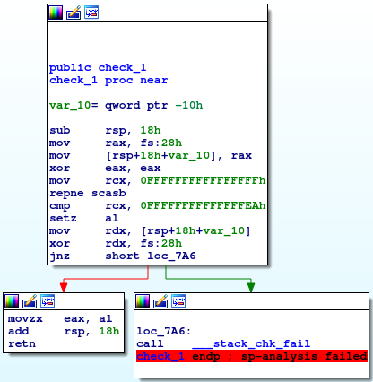
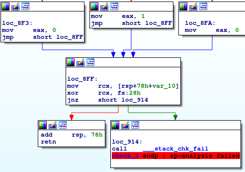

# __ASGama CTF__ 
## _guess_

## Information
**Category:** | **Points:** | **Writeup Author**
--- | --- | ---
Reverse Engineering | 125 | l0l

**Description:** 

> [guess](./guess)


### guess

#### file
```
$ file guess
guess: ELF 64-bit LSB shared object, x86-64, version 1 (SYSV), dynamically linked, interpreter /lib64/ld-linux-x86-64.so.2, for GNU/Linux 3.2.0, BuildID[sha1]=9884fe487838d1390aa0b4db1a0afd7efc07fbca, not stripped
```

#### test run
```
$ ./guess 
Flag??? : ABCD
Wrong!

$ ltrace ./guess 
printf("Flag??? : ")                                                                                                   = 10
__isoc99_scanf(0x55566dec4a3f, 0x7fff0cb018c0, 0, 0Flag??? : ABCD
)                                                                   = 1
puts("Wrong!"Wrong!
)                                                                                                         = 7
+++ exited (status 0) +++
```

Coba disassemble program.

#### main
  

Pada fungsi main ini, program meminta input pada kita lalu memanggil fungsi `check1` dan `check2` dengan parameter input kita.

Setelah kedua fungsi dijalankan, program melakukan `test ebp, eax` dimana `ebp` adalah return value dari fungsi `check1` dan `eax` adalah return value dari fungsi `check2`. Jika hasil operasi `test` bukan 0, maka program akan menampilkan flag. Kita tahu bahwa `test` tidak lain adalah fungsi `and` yang hanya akan menghasilkan nilai 1 apabila kedua operand bernilai 1, selain itu output nya adalah 0. Maka dari sini kita dapat simpulkan bahwa return value dari fungsi `check1` dan `check2` haruslah bernilai 1.


#### check1
  

Pada fungsi check1 program set register `rcx` menjadi `0xffffffffffffffff` (-1) dan `eax` menjadi 0. Lalu melakukan operasi `repne scasb` yang akan men-scan byte-byte dari `rdi` sampai ditemukan sama dengan `al`, dengan `rdi` adalah input kita, tiap perulangan `rcx` dikurangi 1. Dengan kata lain, disini program mengecek panjang string. Lalu diakhir nilai `rcx` dibandingkan dengan `0xffffffffffffffea` (-22), jika sama fungsi `check1` akan return 1, jika tidak return 0. Berarti dari sini kita tahu bahwa panjang input haruslah 20.

#### check2  
  
  

Pada awal fungsi, program melakukan banyak inisialisasi nilai pada memory. Setelah itu membandingkan byte pertama dari input dengan `0x4e` ('N'). Jika tidak sama, fungsi langsung return dengan nilai 0. Berarti kita tahu bahwa huruf pertama input adalah 'N'.

  

Setelah itu fungsi looping dari nilai `eax` = 1 sampai 0x14. Setiap perulangan, fungsi melakukan `xor` antara nilai pada `eax` (yang dipindah ke edx) dengan `[rcx+rax*4]` dimana `rcx` nilainya sama dengan `rsp`. `[rcx+rax*4]` dimulai dari `rsp+78h+var_78` (nilainya = rsp+78-78 = rsp). Setelah di xor, nilainya disimpan pada register `rdx` lalu nilai `rdx` ini digunakan untuk menemukan index pada `stack` dengan cara meload `[rsp+rdx+78h+var_28]` disini kita tahu bahwa isi stack mulai dari `[rsp+78h+var_28]` adalah kumpulan char dalam flag namun urutannya diacak. Urutannya ditentukan dengan hasil `xor` antara index ke-`eax` dengan isi stack mulai address `rsp`.

  
Jika semua perbandingannya hasilnya sama, maka fungsi akan return 1. Jika ada yang berbeda maka return 0.


### Payload
```
char pada flag: 
   0x00005555555547bf <+20>:	mov    BYTE PTR [rsp+0x50],0x30
   0x00005555555547c4 <+25>:	mov    BYTE PTR [rsp+0x51],0x33
   0x00005555555547c9 <+30>:	mov    BYTE PTR [rsp+0x52],0x33
   0x00005555555547ce <+35>:	mov    BYTE PTR [rsp+0x53],0x5f
   0x00005555555547d3 <+40>:	mov    BYTE PTR [rsp+0x54],0x43
   0x00005555555547d8 <+45>:	mov    BYTE PTR [rsp+0x55],0x46
   0x00005555555547dd <+50>:	mov    BYTE PTR [rsp+0x56],0x4c
   0x00005555555547e2 <+55>:	mov    BYTE PTR [rsp+0x57],0x4e
   0x00005555555547e7 <+60>:	mov    BYTE PTR [rsp+0x58],0x5f
   0x00005555555547ec <+65>:	mov    BYTE PTR [rsp+0x59],0x50
   0x00005555555547f1 <+70>:	mov    BYTE PTR [rsp+0x5a],0x54
   0x00005555555547f6 <+75>:	mov    BYTE PTR [rsp+0x5b],0x56
   0x00005555555547fb <+80>:	mov    BYTE PTR [rsp+0x5c],0x58
   0x0000555555554800 <+85>:	mov    BYTE PTR [rsp+0x5d],0x5f
   0x0000555555554805 <+90>:	mov    BYTE PTR [rsp+0x5e],0x65
   0x000055555555480a <+95>:	mov    BYTE PTR [rsp+0x5f],0x6c
   0x000055555555480f <+100>:	mov    BYTE PTR [rsp+0x60],0x6d
   0x0000555555554814 <+105>:	mov    BYTE PTR [rsp+0x61],0x72
   0x0000555555554819 <+110>:	mov    BYTE PTR [rsp+0x62],0x73
   0x000055555555481e <+115>:	mov    BYTE PTR [rsp+0x63],0x74

nilai untuk menentukan index: 
   0x0000555555554823 <+120>:	mov    DWORD PTR [rsp],0x7
   0x000055555555482a <+127>:	mov    DWORD PTR [rsp+0x4],0x3
   0x0000555555554832 <+135>:	mov    DWORD PTR [rsp+0x8],0xe
   0x000055555555483a <+143>:	mov    DWORD PTR [rsp+0xc],0x10
   0x0000555555554842 <+151>:	mov    DWORD PTR [rsp+0x10],0xc
   0x000055555555484a <+159>:	mov    DWORD PTR [rsp+0x14],0x3
   0x0000555555554852 <+167>:	mov    DWORD PTR [rsp+0x18],0x7
   0x000055555555485a <+175>:	mov    DWORD PTR [rsp+0x1c],0xc
   0x0000555555554862 <+183>:	mov    DWORD PTR [rsp+0x20],0x6
   0x000055555555486a <+191>:	mov    DWORD PTR [rsp+0x24],0x6
   0x0000555555554872 <+199>:	mov    DWORD PTR [rsp+0x28],0x7
   0x000055555555487a <+207>:	mov    DWORD PTR [rsp+0x2c],0xb
   0x0000555555554882 <+215>:	mov    DWORD PTR [rsp+0x30],0x9
   0x000055555555488a <+223>:	mov    DWORD PTR [rsp+0x34],0xe
   0x0000555555554892 <+231>:	mov    DWORD PTR [rsp+0x38],0x1c
   0x000055555555489a <+239>:	mov    DWORD PTR [rsp+0x3c],0x5
   0x00005555555548a2 <+247>:	mov    DWORD PTR [rsp+0x40],0x1
   0x00005555555548aa <+255>:	mov    DWORD PTR [rsp+0x44],0x15
   0x00005555555548b2 <+263>:	mov    DWORD PTR [rsp+0x48],0x2
   0x00005555555548ba <+271>:	mov    DWORD PTR [rsp+0x4c],0x1a
```


```py
flag = ['N']
flag += [' ']*20
acak = [0x30,0x33,0x33,0x5f,0x43,0x46,0x4c,0x4e,0x5f,0x50,0x54,0x56,0x58,0x5f,0x65,0x6c,0x6d,0x72,0x73,0x74]


xor_key = [0x7,0x3,0xe,0x10,0xc,0x3,0x7,0xc,0x6,0x6,0x7,0xb,0x9,0xe,0x1c,0x5,0x1,0x15,0x2,0x1a]

for i in range(1,20):
 index = i^xor_key[i]
 flag[i] = chr(acak[index])

print ''.join(flag)
```

### Result
```
$ python solve.py 
N3Xt_L3Vel_0F_sTrCmP 
```

```
$ ./guess 
Flag??? : N3Xt_L3Vel_0F_sTrCmP
Correct! 
Input this : GamaCTF{N3Xt_L3Vel_0F_sTrCmP}
```

### Flag
GamaCTF{N3Xt_L3Vel_0F_sTrCmP}