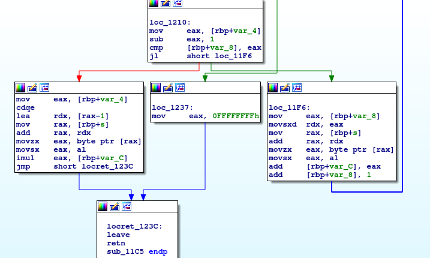

# __ASGama CTF__ 
## _hasssh_

## Information
**Category:** | **Points:** | **Writeup Author**
--- | --- | ---
Reverse Engineering | 250 | l0l

**Description:** 

> Bantu kami mencari kata yang sesuai dengan angka yang diberikan!
>
> nc asgama.web.id 40500
>
> [hasssh](./hasssh)


### hasssh
#### file
```
$ file hasssh 
hasssh: ELF 64-bit LSB shared object, x86-64, version 1 (SYSV), dynamically linked, interpreter /lib64/ld-linux-x86-64.so.2, for GNU/Linux 3.2.0, BuildID[sha1]=9b415485b9886f773741685f69bccc8ddfdd83fd, stripped
```

#### main
  

Program menyuruh kita memasukkan `hash` yang sesuai dengan angka-angka yang akan dikeluarkan.


  

`[rbp+var_3c]` digunakan sebagai counter berapa jawaban kita yang sudah benar sekaligus counter perulangan. Apabila nilainya sudah sama dengan 0xbb7, maka program melakukan `$ cat flag` yang akan menampilkan isi file `flag` yang ada di server.


  

Setiap perulangan, program memanggil fungsi `_rand` yang kemudian nilainya dimod dengan 500. Nilai tersebut kemudian disimpan pada `[rbp+var_38]`. Kemuidan meminta input kita yang disimpan pada `[rbp+var_30]`.

  

Program memanggil fungsi `sub_11c5` yang return valuenya dibandingkan dengan `[rbp+var_38]` ( angka yang dirandom di awal). Jika sama maka `[rbp+var_3c]` ditambah 1.


#### sub_11C5

  
  

Disini input kita dihitung panjangnya. Jika panjang input == 1, maka fungsi langsung return `0xFFFFFFFF` atau `-1`. Namun jika tidak, set `[rbp+var_8]` ke 0, lalu fungsi melakukan loop sebanyak `length-1`.

Perulangan i sebanyak `length-1` kali, fungsi mengambil nilai input pada index ke `[i]` lalu ditambahkan pada `[rbp+var_8]`. Berarti di akhir perulangan, nilai `[rbp+var_8]` adalah `input[0]+input[1]+...+input[-1]`.

Setelah selesai looping, fungsi mengambil nilai pada char terakhir input kita lalu mengalikannya dengan `[rbp+var_8]`. Nilai inilah yang direturn oleh fungsi.

#### solve

Dengan demikian, kita bisa susun payload berupa string yang diakhiri `\x01` untuk pengali. Lalu sebelum `\x01` kita beri karakter-karakter dengan nilai ascii yang jika dijumlah sesuai dengan soal. Perlu diingat disini nilai ascii yang kita kirim tidak boleh lebih dari `0x7f` karena akan dianggap sebagai bilangan negatif.

### Payload
[solve.py](./solve.py)

### Result
```
.
.
.
loop: 0xc53    soal: 122    jawab: 7a01
loop: 0xc54    soal: 281    jawab: 1b7f7f01
loop: 0xc55    soal: 45    jawab: 2d01
loop: 0xc56    soal: 478    jawab: 617f7f7f01
loop: 0xc57    soal: 309    jawab: 377f7f01
loop: 0xc58    soal: 203    jawab: 4c7f01
loop: 0xc59    soal: 448    jawab: 437f7f7f01
loop: 0xc5a    soal: 234    jawab: 6b7f01
loop: 0xc5b    soal: 147    jawab: 147f01
loop: 0xc5c    soal: 232    jawab: 697f01
loop: 0xc5d    soal: 213    jawab: 567f01
loop: 0xc5e    soal: 314    jawab: 3c7f7f01
GamaCTF{T3r1M4_k45iH_5uDaH_mEM13eR1k4n_B4Ny4K_k4tA}

```

Seperti yang terlihat, perlu 0xc5e perulangan sebelum kita mendapatkan flag. Berarti masih ada beberapa bilangan yang salah diinterpretasikan. Masih belum menemukan algoritma yang pas.


### Flag
GamaCTF{T3r1M4_k45iH_5uDaH_mEM13eR1k4n_B4Ny4K_k4tA}