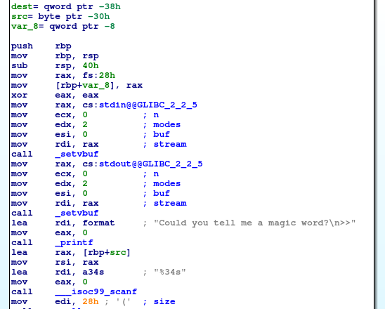
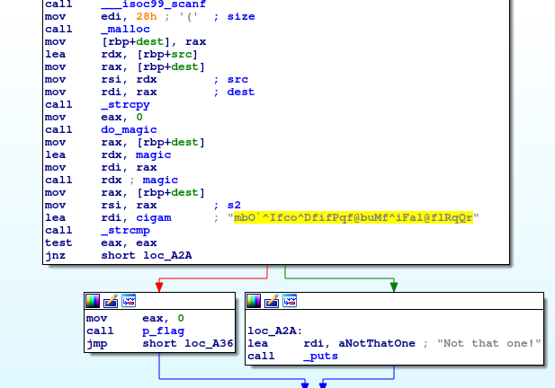
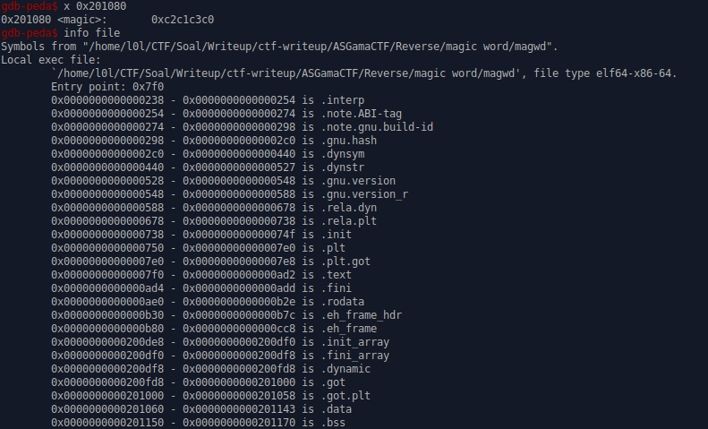
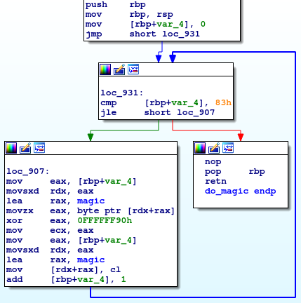

# __ASGama CTF__ 
## _magic word_

## Information
**Category:** | **Points:** | **Writeup Author**
--- | --- | ---
Reverse Engineering | 200 | l0l

**Description:** 

> nc asgama.web.id 40502
>
> [magwd](./magwd)


### magic word

#### file
```
$ file magwd 
magwd: ELF 64-bit LSB shared object, x86-64, version 1 (SYSV), dynamically linked, interpreter /lib64/ld-linux-x86-64.so.2, for GNU/Linux 3.2.0, BuildID[sha1]=83e3346da094e8945d1b188b1a4d4d8877f7159c, not stripped
```

Setelah cek dengan `ltrace ./magwd`, input kita awalnya diubah dulu menjadi string lain, lalu dibandingkan dengan `mbO`^Ifco^DfifPqf@buMf^iFal@flRqQr`. Maka coba lihat disassemble nya dengan ida.

#### main

  
  

Pada bagian ini, program meminta input lalu disimpan pada `[rbp+src]`, setelah itu melakukan `malloc` dengan size 0x28. Address heap disimpan pada `[rbp+dest]`. Lalu string input kita dicopy pada address heap tersebut.

Setelah itu, program memanggil fungsi `do_magic` lalu memanggil `magic` dengan parameter input kita.
`magic` disini setelah dicek degan gdb ternyata terletak pada data segment.  
  

Lihat address magic yang ternyata terletak dalam range address .data segment. Isinya pun masih acak.

#### do_magic
  

Fungsi ini mengubah isi dari address `magic` menjadi sebuah fungsi yang utuh.

#### magic
Karena sulit memahami apa yang sebenarnya dilakukan oleh fungsi `do_magic`, saya lakukan debugging dengan `gdb` dengan memasang breakpoint sesudah fungsi `do_magic` selesai. Sehingga saya bisa mendisassembly isi fungsi `magic` setelah jadi.

Hasilnya seperti ini:

```
   0x0000555555755080 <magic+0>:	push   rax
   0x0000555555755081 <magic+1>:	push   rbx
   0x0000555555755082 <magic+2>:	push   rcx
   0x0000555555755083 <magic+3>:	push   rdx
   0x0000555555755084 <magic+4>:	mov    rax,0x0
   0x000055555575508b <magic+11>:	mov    rbx,0x0
   0x0000555555755092 <magic+18>:	mov    rcx,0x0
   0x0000555555755099 <magic+25>:	mov    rdx,0x0
   0x00005555557550a0 <magic+32>:	mov    bl,BYTE PTR [rdi+rax*1]
   0x00005555557550a3 <magic+35>:	inc    rax
   0x00005555557550a6 <magic+38>:	test   bl,bl
   0x00005555557550a8 <magic+40>:	jne    0x5555557550a0 <magic+32>
   0x00005555557550aa <magic+42>:	dec    rax
   0x00005555557550ad <magic+45>:	mov    ecx,0x64
   0x00005555557550b2 <magic+50>:	push   0x0
   0x00005555557550b4 <magic+52>:	mov    DWORD PTR [rsp],eax
   0x00005555557550b7 <magic+55>:	mov    dl,BYTE PTR [rdi]
   0x00005555557550b9 <magic+57>:	mov    BYTE PTR [rsp+0x4],dl
   0x00005555557550bd <magic+61>:	mov    ebx,0x0
   0x00005555557550c2 <magic+66>:	jmp    0x5555557550dc <magic+92>
   0x00005555557550c4 <magic+68>:	lea    rax,[rdi+rbx*1]
   0x00005555557550c8 <magic+72>:	mov    dl,BYTE PTR [rax]
   0x00005555557550ca <magic+74>:	mov    BYTE PTR [rsp+0x6],dl
   0x00005555557550ce <magic+78>:	mov    dl,BYTE PTR [rsp+0x4]
   0x00005555557550d2 <magic+82>:	mov    BYTE PTR [rax],dl
   0x00005555557550d4 <magic+84>:	mov    dl,BYTE PTR [rsp+0x6]
   0x00005555557550d8 <magic+88>:	mov    BYTE PTR [rsp+0x4],dl
   0x00005555557550dc <magic+92>:	inc    ebx
   0x00005555557550de <magic+94>:	cmp    ebx,DWORD PTR [rsp]
   0x00005555557550e1 <magic+97>:	jne    0x5555557550c4 <magic+68>
   0x00005555557550e3 <magic+99>:	mov    BYTE PTR [rdi],dl
   0x00005555557550e5 <magic+101>:	dec    rbx
   0x00005555557550e8 <magic+104>:	lea    rdx,[rdi+rbx*1]
   0x00005555557550ec <magic+108>:	mov    ax,WORD PTR [rdx]
   0x00005555557550ef <magic+111>:	dec    ax
   0x00005555557550f2 <magic+114>:	mov    WORD PTR [rdx],ax
   0x00005555557550f5 <magic+117>:	dec    ecx
   0x00005555557550f7 <magic+119>:	test   ecx,ecx
   0x00005555557550f9 <magic+121>:	jne    0x5555557550b7 <magic+55>
   0x00005555557550fb <magic+123>:	add    rsp,0x8
   0x00005555557550ff <magic+127>:	pop    rdx
   0x0000555555755100 <magic+128>:	pop    rcx
   0x0000555555755101 <magic+129>:	pop    rbx
   0x0000555555755102 <magic+130>:	pop    rax
   0x0000555555755103 <magic+131>:	ret    
```

#### breakdown
```
<magic+0>:  	push   rax
<magic+1>:  	push   rbx
<magic+2>:  	push   rcx
<magic+3>:  	push   rdx
<magic+4>:  	mov    rax,0x0
<magic+11>  :	mov    rbx,0x0
<magic+18>  :	mov    rcx,0x0
<magic+25>  :	mov    rdx,0x0

# htung panjang string disimpan di rax
<magic+32>  :	mov    bl,BYTE PTR [rdi+rax*1]
<magic+35>  :	inc    rax
<magic+38>  :	test   bl,bl
<magic+40>  :	jne    0x5555557550a0 <magic+32>
<magic+42>  :	dec    rax

# ecx sebagai counter loop besar
<magic+45>  :	mov    ecx,0x64
<magic+50>  :	push   0x0
<magic+52>  :	mov    DWORD PTR [rsp],eax
# input index ke-0 masukin ke [rsp+0x4]
<magic+55>  :	mov    dl,BYTE PTR [rdi]
<magic+57>  :	mov    BYTE PTR [rsp+0x4],dl
<magic+61>  :	mov    ebx,0x0
<magic+66>  :	jmp    0x5555557550dc <magic+92> --------
                                                        |
    # loop di bawah ini untuk shift string kita         |  
    # misal "ABCD" menjadi "ACDA" (char B disimpan) [rsp+0x4]
    <magic+68>  :	lea    rax,[rdi+rbx*1]              |
    <magic+72>  :	mov    dl,BYTE PTR [rax]            |
    <magic+74>  :	mov    BYTE PTR [rsp+0x6],dl        |
    <magic+78>  :	mov    dl,BYTE PTR [rsp+0x4]        |
    <magic+82>  :	mov    BYTE PTR [rax],dl            |
    <magic+84>  :	mov    dl,BYTE PTR [rsp+0x6]        |
    <magic+88>  :	mov    BYTE PTR [rsp+0x4],dl        |
                                                        |
# [rsp] = pjg string                                    |
<magic+92>  :	inc    ebx                      <-------
<magic+94>  :	cmp    ebx,DWORD PTR [rsp]
<magic+97>  :	jne    0x5555557550c4 <magic+68>

# setelah selesai shift, char pertama yang disimpan di dl dikembalikan
# "ACDA" -> "BCDA"
<magic+99>  :	mov    BYTE PTR [rdi],dl
<magic+101> :	dec    rbx
<magic+104> :	lea    rdx,[rdi+rbx*1]

# nilai pada char pertama setelah shift (misal 'B' dikurangi 1 -> menjadi 'A')
<magic+108> :	mov    ax,WORD PTR [rdx]
<magic+111> :	dec    ax
<magic+114> :	mov    WORD PTR [rdx],ax
<magic+117> :	dec    ecx
<magic+119> :	test   ecx,ecx
<magic+121> :	jne    0x5555557550b7 <magic+55>

# lakukan proses di atas sebanyak 0x64 kali

<magic+123> :	add    rsp,0x8
<magic+127> :	pop    rdx
<magic+128> :	pop    rcx
<magic+129> :	pop    rbx
<magic+130> :	pop    rax
<magic+131> :	ret   
```

### Payload
```py
string = list("mbO`^Ifco^DfifPqf@buMf^iFal@flRqQr")

for i in range(0x64):
    string[-1] = chr(ord(string[-1])+1)
    string = string[1:]+list(string[0])

print ''.join(string)
```

### Result
```
$ python solve.py
SupeRcaLifraGiliStiCexPialIdoCioUs
```


```
$ nc asgama.web.id 40502
Could you tell me a magic word?
>>SupeRcaLifraGiliStiCexPialIdoCioUs
Perfect!
GamaCTF{M461C_w0Rd_Fr0m_w1k1}
```
### Flag
GamaCTF{M461C_w0Rd_Fr0m_w1k1}