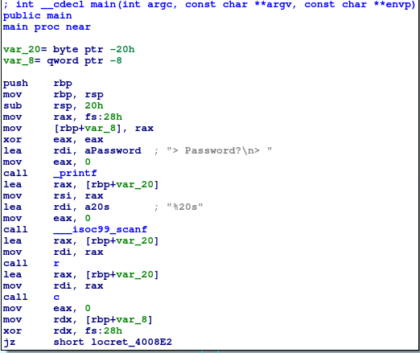
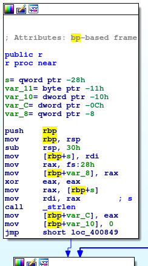
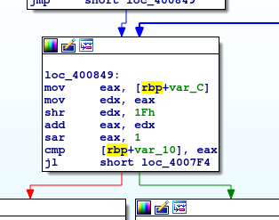
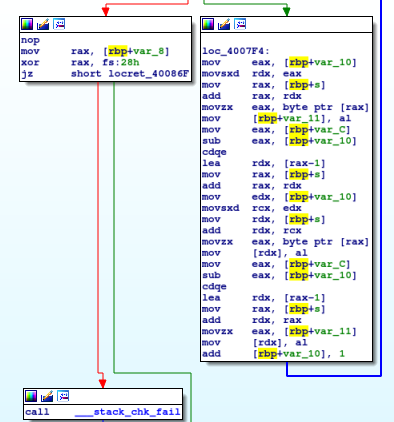
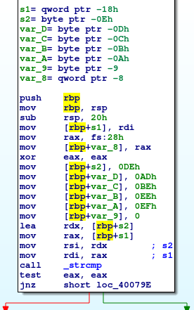
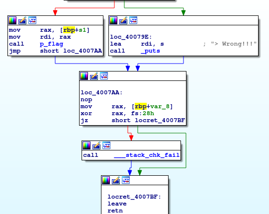
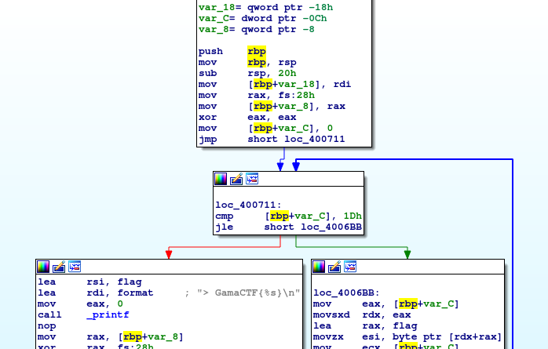
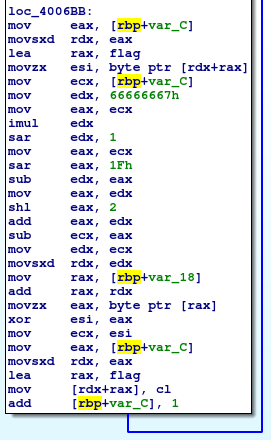

# __ASGama CTF__ 
## _pwd_

## Information
**Category:** | **Points:** | **Writeup Author**
--- | --- | ---
Reverse Engineering | 80 | l0l

**Description:** 

> [pwd](./pwdrev)

### pwd
Identifikasi file binary yang diberikan.  
```
$ file pwdrev 
pwdrev: ELF 64-bit LSB executable, x86-64, version 1 (SYSV), dynamically linked, interpreter /lib64/ld-linux-x86-64.so.2, for GNU/Linux 3.2.0, BuildID[sha1]=bc6b19668880af976c20bb2169ad41596a6f4c2d, not stripped
```

Coba jalankan program tersebut.  
```
$ ./pwdrev 
> Password?
> ABCD
> Wrong!!!
```

Lalu coba jalankan dengan `ltrace`  
```
$ ltrace ./pwdrev
printf("> Password?\n> "> Password?
)                                                                                              = 14
__isoc99_scanf(0x40099d, 0x7ffc42251930, 0, 0> ABCD
)                                                                         = 1
strlen("ABCD")                                                                                                         = 4
strcmp("DCBA", "\336\255\276\356\357")                                                                                 = -157
puts("> Wrong!!!"> Wrong!!!
)                                                                                                     = 11
+++ exited (status 0) +++
```

Terlihat pada **strcmp("DCBA", "\336\255\276\356\357")** input kita dibalik lalu dibandingkan dengan suatu string.

Coba saja kita beri input string "\336\255\276\356\357" yang dibalik.
```
$ python -c "print '\336\255\276\356\357'[::-1]" | ./pwdrev
```

Metode lain yang dapat digunakan yaitu melakukan disassemble pada program. 

#### main


Pada fungsi main di atas, program meminta input kita lalu menyimpannya pada alamat yang ada di `rbp+var_20`. Setelah itu, program menggunakan input kita sebagai argumen untuk pemanggilan fungsi `r`. Terlihat dari alamat address yang terletak pada `rbp+var_20` diload ke `rdi` sebelum memanggil fungsi `r`.  

#### r


Pada awal fungsi `r`, input kita dimasukkan ke alamat address yang disimpat `rbp+s`. Kemudian dihitung panjang string lalu hasil perhitungannya dimasukkan ke alamat di `rbp+var_c`. Lalu set nilai pada alamat di `rbp+var_10` menjadi 0. Nilai ini digunakan sebagai `counter` untuk loop.



Pada bagian ini, program melakukan pengecekan apakah nilai pada `[rbp+var_10]` masih lebih kecil dari `rbp+var_c // 2`. Yaitu panjang string dibagi 2.



Selama nilai pada `[rbp+var_10]` masih lebih kecil dari `[rbp+var_c]`, maka program akan melakukan pertukaran isi pada input index ke `[rbp+var_10]` dengan `[rbp+var_c-1-[rbp+var_10]]`.

#### c


Input kita setelah dibalik ( reverse ) pada fungsi r, dijadikan argumen untuk pemanggilan fungsi c. Lalu input kita dimasukkan pada `[rbp+s1]`. Setelah itu program melakukan assignment nilai untuk `rbp+s2`,`rbp+var_D`,`rbp+var_C`,`rbp+var_B`,`rbp+var_A`,`rbp+var_9`, berturut-turut dengan nilai `[DEh,ADh,BEh,EEh,EFh,0h]`. Dengan demikian, pada `rbp+s2` jika dilihat nilainya menjadi `EFEEBEADDE` karena little endian. 



Lalu input kita setelah direverse tadi dibandingkan dengan nilai `EFEEBEADDE`. Jika sama program akan memanggil fungsi `p_flag`, jika tidak, program mengoutputkan string "> Wrong!!!".

Dari sini dapat kita tebak bahwa tujuan kita adalah untuk mencapai fungsi `p_flag`, yang berarti input kita setelah dibalik harus sama dengan `EFEEBEADDE`. Karena little endian, berarti input kita dalam memory disimpan sudah terbalik dulu, lalu dibalik lagi pada fungsi `r`. Yang berarti kita harus menginputkan `\xef\xee\xbe\xad\xde` yang mana di memory akan disimpan menjadi `deadbeeeef`, lalu oleh fungsi `r` diubah menjadi `EFEEBEADDE`.

Cara lain untuk solve soal ini adalah dengan mereverse langsung fungsi `p_flag`. Kita tahu bahwa program ini offline. Yang berarti bahwa string flag sudah ada dalam program itu sendiri. Hanya saja bukan dalam bentuk plain text, melainkan semacam dienkripsi.

#### p_flag



Input kita dimasukkan dalam `[rbp+var_18]`, lalu set counter `[rbp+var_c]` menjadi 0. Program akan terus looping sampai nilai `[rbp+var_c]` lebih dari 0x1d. Jika sudah selesai loop, maka program akan print isi dari variable `flag`.



Berdasarkan post [ini](https://reverseengineering.stackexchange.com/questions/1397/how-can-i-reverse-optimized-integer-division-modulo-by-constant-operations), dan [ini](https://stackoverflow.com/questions/30790184/perform-integer-division-using-multiplication) bagian :
```
   0x00000000004006cc <+53>:	mov    ecx,DWORD PTR [rbp-0xc]
   0x00000000004006cf <+56>:	mov    edx,0x66666667
   0x00000000004006d4 <+61>:	mov    eax,ecx
   0x00000000004006d6 <+63>:	imul   edx
   0x00000000004006d8 <+65>:	sar    edx,1
   0x00000000004006da <+67>:	mov    eax,ecx
   0x00000000004006dc <+69>:	sar    eax,0x1f
   0x00000000004006df <+72>:	sub    edx,eax
   0x00000000004006e1 <+74>:	mov    eax,edx
   0x00000000004006e3 <+76>:	shl    eax,0x2
   0x00000000004006e6 <+79>:	add    eax,edx
   0x00000000004006e8 <+81>:	sub    ecx,eax
   0x00000000004006ea <+83>:	mov    edx,ecx
   0x00000000004006ec <+85>:	movsxd rdx,edx
```  
kemungkinan adalah operasi mod dengan magic number 0x66666667. Dan dengan bantuan dari [sini](http://www.hackersdelight.org/magic.htm), kita bisa brute force bilangan pembagi berapa yang magic numbernya adalah 0x66666667. Ternyata bilangan pembagi tersebut adalah 5. Dari sini kita bisa katakan bahwa operasi di atas adalah modulo 5 untuk nilai `rbp+var_c`. Hasil modulo dimasukkan ke dalam register `rdx`.

Setelah itu, variable `flag` index ke `rbp+var_c` di xor dengan input kita pada index ke `rdx`. Ini adalah enkripsi xor dengan key input kita.

Selanjutnya kita cukup lihat isi dari variable flag sebelum dixor di dalam memory. Lalu kita xor dengan key `\xde\xad\xbe\xee\xef`.

```
0x601010 <flag>:	0xb18de5aa	0xcddeeabf	0xc9acdfb9	0x819cdfe1
0x601020 <flag+16>:	0xa0818ef9	0xa1d19db1	0x8ee5adb0	0x0000bb9c
```


### Payload
`$ python -c "print '\336\255\276\356\357'[::-1]" | ./pwdrev`
`$ python -c "print '\xde\xad\xbe\xee\xef'[::-1]" | ./pwdrev`


```py
from pwn import *

c = """b18de5aa cddeeabf c9acdfb9 819cdfe1 a0818ef9 a1d19db1 8ee5adb0 bb9c""".split(' ')
c2 = ""
for i in c:
    c2+=i.decode('hex')[::-1]

c = c2
key = "deadbeeeef".decode('hex')
flag = ""

for i in range(len(c)):
    flag += chr(ord(c[i])^ord(key[i%len(key)]))

print flag
```


### Result
```
$ python -c "print '\336\255\276\356\357'[::-1]" | ./pwdrev
> Password?
> > GamaCTF{tH3_P4ssW0rd_1s_T0oOo0oO_sH0rT}
```

```
$ python -c "print '\xde\xad\xbe\xee\xef'[::-1]" | ./pwdrev
> Password?
> > GamaCTF{tH3_P4ssW0rd_1s_T0oOo0oO_sH0rT}
```

```
$ python solve.py 
tH3_P4ssW0rd_1s_T0oOo0oO_sH0rT
```

### Flag
GamaCTF{tH3_P4ssW0rd_1s_T0oOo0oO_sH0rT}