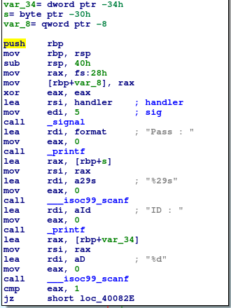
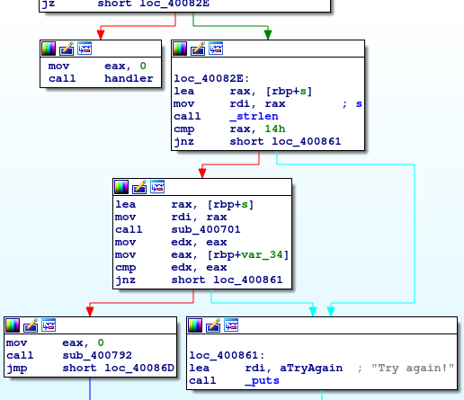
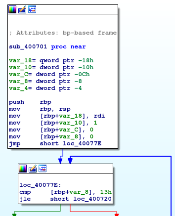
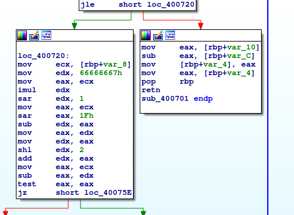
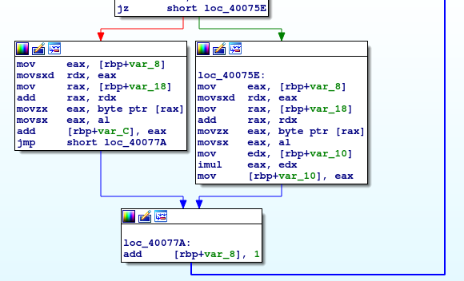

# __ASGama CTF__ 
## _stripped_

## Information
**Category:** | **Points:** | **Writeup Author**
--- | --- | ---
Reverse Engineering | 130 | l0l

**Description:** 

> nc asgama.web.id 40501
>
> [stripped](./stripped)


### stripped

#### file
```
$ file stripped 
stripped: ELF 64-bit LSB executable, x86-64, version 1 (SYSV), dynamically linked, interpreter /lib64/ld-linux-x86-64.so.2, for GNU/Linux 3.2.0, BuildID[sha1]=6a12a526babce80606e546ec5655e4bc37766555, stripped
```

Sesuai judul soal, kita diberikan sebuah binary file `stripped`. Berarti nama-nama fungsi diubah atau dihilangkan.

#### run program
```
./stripped 
Pass : ABCD
ID : 123
Try again!
```

Bila kita buka di `ida`, maka fungsi `main` terdefinisi. Sehingga bisa langsung kita reverse seperti biasa, hanya saja fungsi-fungsi lainnya berubah namanya.

#### main



Di bagian ini, program meminta dua buah input yaitu `pass` dan `id`. `pass` disimpan pada `[rbp+var_s]` sementara `id` disimpan pada `[rbp+var_34]`



Di sini `pass` dicek panjangnya dengan 0x14. Jika sama dengan 0x14, program memanggil fungsi `sub_400701` dengan parameter `pass`. Hasilnya dibandingkan dengan `id`. Jika sama, program akan memanggil fungsi `sub_400792` yang akan print isi flag.

#### sub_400701

  
Pertama, `pass` dimasukkan ke `[rbp+var_18]`. Lalu set `[rbp+var_10]` menjadi 1,`[rbp+var_c]` menjadi 0,`[rbp+var_8]` menjadi 0. Lalu `[rbp+var_18]` digunakan untuk counter loop sampai nilainya lebih dari 0x13. 





Pada bagian ini, seperti pada soal [pwd](../pwd/README.md), yang di sebelah kiri adalah proses pengecekan apakah `[rbp+var_8]` habis dibagi 5 (`[rbp+var_8] % 5 == 0`). Jika iya, maka set nilai `[rbp+var_10]` = `[rbp+var_10] * input index ke-[rbp+var_8]`. Jika tidak, maka set nilai `[rbp+var_C]` = `[rbp+var_c] + input index ke-[rbp+var_8]`. 

Intinya disini adalah untuk setiap index kelipatan 5, maka update nilai pada `[rbp+var_10]` dikali nilai input pada index tersebut. Selain index kelipatan 5, maka update nilai pada `[rbp+var_c]` ditambah nilai input pada index tersebut.

Sementara nilai yang direturn oleh fungsi ini adalah `[rbp+var_10] - [rbp+var_c]`. Nilai inilah yang nantinya dicocokkan dengan input kita di bagian `id`. Jika sama berarti program akan menampilkan flag.

### Payload
```py
from pwn import *
r = remote('asgama.web.id',40501)

# definisikan input password bebas asal panjangnya 0x14
password = 'A'*0x14

# hitung formulasi id untuk input di atas
kali = 1 # rbp+var_10
tambah = 0 # rbp+var_c

for i in range(len(input)):
    if (i%5): kali*=ord(input[i])
    else: tambah += ord(input[i])

r.recvuntil('Pass : ')
r.sendline(password)

r.recvuntil('ID : ")
r.sendline(str(kali-tambah))

print r.recvall()
```


### Result
```
$ python solve.py
[+] Opening connection to asgama.web.id on port 40501: Done
[+] Receiving all data: Done (69B)
[*] Closed connection to asgama.web.id port 40501
Congrats!, here's your present : GamaCTF{5tr1pp3d_B1n4ry_I5_d4_B45t}
```

### Flag
GamaCTF{5tr1pp3d_B1n4ry_I5_d4_B45t}