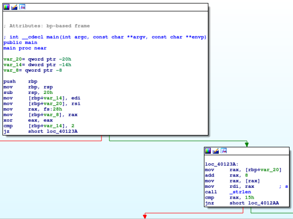
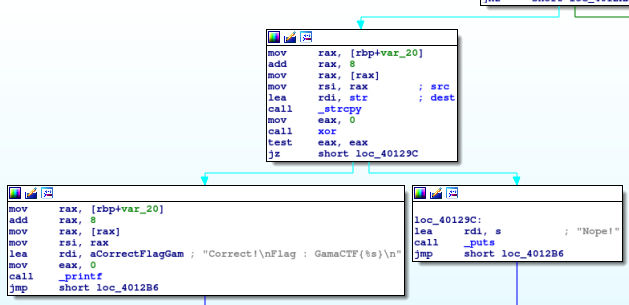
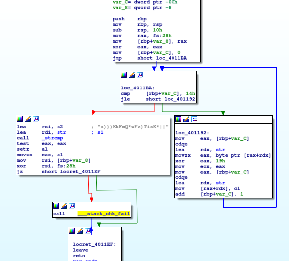

# __ASGama CTF__ 
## _xor in reverse_

## Information
**Category:** | **Points:** | **Writeup Author**
--- | --- | ---
Reverse Engineering | 50 | l0l

**Description:** 

> [xorinreverse](./Xrev)


### xor in reverse  
Diberikan sebuah executable binary.  
```
$ file Xrev 
Xrev: ELF 64-bit LSB executable, x86-64, version 1 (SYSV), dynamically linked, interpreter /lib64/ld-linux-x86-64.so.2, for GNU/Linux 3.2.0, BuildID[sha1]=9ee3607eaf1afcdace0582cc5bad4b670bb73f3e, not stripped
```

Coba jalankan program.  
```
$ ./Xrev 
Usage : ./Xrev flag
$ ./Xrev ABCD
Panjang salah!
$ ltrace ./Xrev ABCD
strlen("ABCD")                                                                                                         = 4
puts("Panjang salah!"Panjang salah!
)                                                                                                 = 15
```

Dari sini kita belum menerima informasi yang berguna. Command `strings` pun juga tidak membantu. Jadi coba buka program dengan disassembler. Disini saya menggunakan `ida`.

  
Dari potongan program di atas, kita tahu bahwa program mengambil 2 argumen untuk run. Lalu panjang argumen kedua (flag) dibandingkan dengan 0x15. Berarti **panjang flag adalah 0x15**  

  
Jika panjang flag sudah benar, maka program memanggil fungsi `xor`, yang mana jika return value fungsi tersebut adalah 0 berarti input benar dan program menampilkan flag.

Sekarang kita lihat hasil disassembly fungsi `xor`.  
  
Dari hasil disassembly di atas bisa kita lihat bahwa tiap karakter dalam input kita di-xor dengan 0x19. Setelah semuanya di-xor, hasilnya dibandingkan dengan string "a)))KkFmQ*wFz)TixK*||".

Dengan demikian kita tahu bahwa flag adalah "a)))KkFmQ*wFz)TixK*||" di-xor dengan 0x19.

### Payload
```
python -c "from pwn import *;c='a)))KkFmQ*wFz)TixK*||'; print xor(c,chr(0x19)*len(c)) "
```

### Result
```
$ python -c "from pwn import *;print xor('a)))KkFmQ*wFz)TixK*||',chr(0x19))"
x000Rr_tH3n_c0MpaR3ee
```

```
$ ./Xrev x000Rr_tH3n_c0MpaR3ee
Correct!
Flag : GamaCTF{x000Rr_tH3n_c0MpaR3ee}
```

### Flag
GamaCTF{x000Rr_tH3n_c0MpaR3ee}