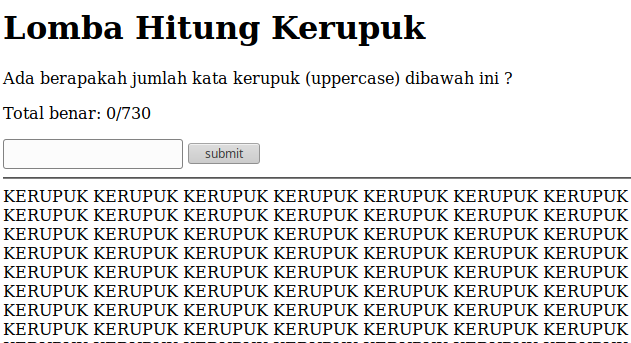

# __ASGama CTF__ 
## _Lomba Makan Kerupuk_

## Information
**Category:** | **Points:** | **Writeup Author**
--- | --- | ---
Web | 125 | l0l

**Description:** 

> Biasanya klo 17 agustus ada lomba makan kerupuk, jadi untuk ctf saya ganti jadi lomba hitung kerupuk ^_^
>
> http://gamactf.asgama.web.id:41001/


### Lomba Makan Kerupuk
Jika kita kunjungi link yang diberikan, service cukup sederhana. Tiap dikunjungi, service memberi tampilan utama disertai banyak kata "KERUPUK" yang jumlahnya berubah-ubah.  


Kita harus menjawab benar sebanyak 730 kali. Untuk itu saya gunakan script python untuk mengerjakan soal ini secara otomatis.

Pertama, kita lihat dulu header dan kode html page ini.  
```
curl -v http://gamactf.asgama.web.id:41001/
```  

Result :
```html
> GET / HTTP/1.1
> Host: gamactf.asgama.web.id:41001
> User-Agent: curl/7.58.0
> Accept: */*
> 
< HTTP/1.1 200 OK
< Host: gamactf.asgama.web.id:41001
< Date: Sat, 29 Dec 2018 06:27:09 +0000
< Connection: close
< X-Powered-By: PHP/7.2.6
< Set-Cookie: PHPSESSID=af3c89c374a7b19406dfb096d828ef13; path=/
< Expires: Thu, 19 Nov 1981 08:52:00 GMT
< Cache-Control: no-store, no-cache, must-revalidate
< Pragma: no-cache
< Content-type: text/html; charset=UTF-8
< 

<!DOCTYPE html>
<html lang="en">
<head>
    <meta charset="UTF-8">
    <meta name="viewport" content="width=device-width, initial-scale=1.0">
    <meta http-equiv="X-UA-Compatible" content="ie=edge">
    <title>Lomba Hitung Kerupuk</title>
</head>
<body>
    <h1>Lomba Hitung Kerupuk</h1>
    <p>Ada berapakah jumlah kata kerupuk (uppercase) dibawah ini ?</p>
    <p>Total benar: 0/730</p>
        <form action="">
        <input type="text" name="jumlah">
        <input type="submit" value="submit">
    </form>
    <hr>
    KERUPUK KERUPUK KERUPUK KERUPUK KERUPUK KERUPUK KERUPUK KERUPUK KERUPUK KERUPUK KERUPUK KERUPUK KERUPUK KERUPUK KERUPUK KERUPUK KERUPUK KERUPUK KERUPUK KERUPUK KERUPUK KERUPUK KERUPUK KERUPUK KERUPUK KERUPUK KERUPUK KERUPUK KERUPUK KERUPUK KERUPUK KERUPUK KERUPUK KERUPUK KERUPUK KERUPUK KERUPUK KERUPUK KERUPUK KERUPUK KERUPUK KERUPUK KERUPUK KERUPUK KERUPUK KERUPUK KERUPUK KERUPUK KERUPUK KERUPUK KERUPUK KERUPUK KERUPUK KERUPUK KERUPUK KERUPUK KERUPUK KERUPUK KERUPUK KERUPUK KERUPUK KERUPUK KERUPUK KERUPUK KERUPUK KERUPUK KERUPUK KERUPUK KERUPUK KERUPUK KERUPUK KERUPUK KERUPUK KERUPUK KERUPUK KERUPUK KERUPUK KERUPUK KERUPUK KERUPUK KERUPUK KERUPUK KERUPUK KERUPUK KERUPUK KERUPUK KERUPUK KERUPUK KERUPUK KERUPUK KERUPUK KERUPUK KERUPUK KERUPUK KERUPUK KERUPUK KERUPUK KERUPUK KERUPUK KERUPUK KERUPUK KERUPUK KERUPUK KERUPUK KERUPUK KERUPUK KERUPUK KERUPUK KERUPUK KERUPUK KERUPUK KERUPUK KERUPUK KERUPUK KERUPUK KERUPUK KERUPUK KERUPUK KERUPUK KERUPUK KERUPUK KERUPUK KERUPUK KERUPUK KERUPUK KERUPUK KERUPUK KERUPUK KERUPUK KERUPUK KERUPUK KERUPUK KERUPUK KERUPUK KERUPUK KERUPUK KERUPUK KERUPUK KERUPUK KERUPUK KERUPUK KERUPUK KERUPUK KERUPUK KERUPUK KERUPUK KERUPUK KERUPUK KERUPUK KERUPUK KERUPUK KERUPUK KERUPUK KERUPUK KERUPUK KERUPUK KERUPUK KERUPUK KERUPUK KERUPUK KERUPUK KERUPUK KERUPUK KERUPUK KERUPUK KERUPUK KERUPUK KERUPUK KERUPUK KERUPUK KERUPUK KERUPUK KERUPUK KERUPUK KERUPUK KERUPUK KERUPUK KERUPUK KERUPUK KERUPUK KERUPUK KERUPUK KERUPUK KERUPUK KERUPUK KERUPUK KERUPUK KERUPUK KERUPUK KERUPUK KERUPUK KERUPUK KERUPUK KERUPUK KERUPUK KERUPUK KERUPUK KERUPUK KERUPUK KERUPUK KERUPUK KERUPUK KERUPUK KERUPUK KERUPUK KERUPUK KERUPUK KERUPUK KERUPUK KERUPUK KERUPUK KERUPUK KERUPUK KERUPUK KERUPUK KERUPUK KERUPUK KERUPUK KERUPUK KERUPUK KERUPUK KERUPUK KERUPUK KERUPUK KERUPUK KERUPUK KERUPUK KERUPUK KERUPUK KERUPUK KERUPUK KERUPUK KERUPUK KERUPUK KERUPUK KERUPUK KERUPUK KERUPUK KERUPUK KERUPUK KERUPUK KERUPUK KERUPUK KERUPUK KERUPUK KERUPUK KERUPUK KERUPUK KERUPUK KERUPUK KERUPUK KERUPUK KERUPUK KERUPUK KERUPUK KERUPUK KERUPUK KERUPUK KERUPUK KERUPUK KERUPUK KERUPUK KERUPUK KERUPUK KERUPUK KERUPUK KERUPUK KERUPUK KERUPUK KERUPUK KERUPUK KERUPUK KERUPUK KERUPUK KERUPUK KERUPUK KERUPUK KERUPUK KERUPUK KERUPUK KERUPUK KERUPUK KERUPUK KERUPUK KERUPUK KERUPUK KERUPUK KERUPUK KERUPUK KERUPUK KERUPUK KERUPUK KERUPUK KERUPUK KERUPUK KERUPUK KERUPUK KERUPUK KERUPUK KERUPUK KERUPUK KERUPUK KERUPUK KERUPUK KERUPUK KERUPUK KERUPUK KERUPUK KERUPUK KERUPUK KERUPUK KERUPUK KERUPUK KERUPUK KERUPUK KERUPUK KERUPUK KERUPUK KERUPUK KERUPUK KERUPUK KERUPUK KERUPUK KERUPUK KERUPUK KERUPUK KERUPUK KERUPUK KERUPUK KERUPUK KERUPUK KERUPUK KERUPUK KERUPUK KERUPUK KERUPUK KERUPUK KERUPUK KERUPUK KERUPUK KERUPUK KERUPUK KERUPUK KERUPUK KERUPUK KERUPUK KERUPUK KERUPUK KERUPUK KERUPUK KERUPUK KERUPUK KERUPUK KERUPUK KERUPUK KERUPUK KERUPUK KERUPUK KERUPUK KERUPUK KERUPUK KERUPUK KERUPUK KERUPUK KERUPUK KERUPUK KERUPUK KERUPUK KERUPUK KERUPUK </body>
</html>
```

Web ternyata juga memberi cookie PHPSESSID, untuk 'mengingat' sudah berapa kali kita benar menjawab. Jawaban kita dimasukkan dalam form dengan metode GET, parameternya adalah "jumlah".

Strings "KERUPUK" diletakkan pada body.


### Payload
[solve.py](./solve.py)

### Result
```
730
Finished : 

<!DOCTYPE html>
<html lang="en">
<head>
    <meta charset="UTF-8">
    <meta name="viewport" content="width=device-width, initial-scale=1.0">
    <meta http-equiv="X-UA-Compatible" content="ie=edge">
    <title>Lomba Hitung Kerupuk</title>
</head>
<body>
    <h1>Lomba Hitung Kerupuk</h1>
    <p>Ada berapakah jumlah kata kerupuk (uppercase) dibawah ini ?</p>
    <p>Total benar: 730/730</p>
    <p>ANDA MENANG !!! GamaCTF{kerupuk_nikmaat_dan_mantaap}</p>    <form action="">
        <input type="text" name="jumlah">
        <input type="submit" value="submit">
    </form>

```

### Flag
GamaCTF{kerupuk_nikmaat_dan_mantaap}