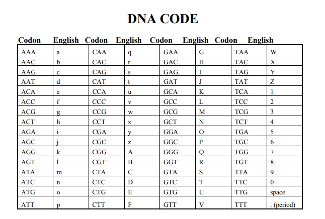

# acid (-_-)
## 250 points | 34 solves

### Description
> friska like a vampire HAHAHAHA  
> format flag: hacktoday{flag}  
> author: monhack  

Diberikan file [acid.txt](./challenge/acid.txt) berisi serangkaian huruf yang mirip seperti simbol penyusun DNA (?).  
Yang pertama saya lakukan mencoba decode dengan mentranslate 3 rangkaian huruf menjadi 1 huruf awal dari nama asam yang disusun, seperti yg dilakukan tools [ini](https://www.dcode.fr/codons-genetic-code). Namun tidak berhasil.

Abis cari-cari [WU](https://embeddedworld.home.blog/2019/05/16/hacking-walkthrough-ctf-challenge/) ternyata ada nih yg implement soal mirip. Menggunakan table di bawah.  
  
Udah ada source code solver nya malah, tinggal edit dikit -_____-  
[solver](./solution/solve.py)

### Result
Asam deoksiribonukleat lebih dikenal dengan singkatan DNA adalah sejenis biomolekul yang menyimpan dan menyandi instruksi instruksi genetika setiap organisme dan banyak jenis virus instruksi instruksi genetika ini berperan penting dalam pertumbuhanperkembangan dan fungsi organisme dan virus DNA merupakan asam nukleat bersamaan dengan protein dan karbohidrat asam nukleat adalah makromolekul esensial bagi seluruh makhluk hidup yang diketahuiKebanyakan molekul DNA terdiri dari dua unting biopolimer yang berpilin satu sama lainnya membentuk heliks gandaDua unting DNA ini dikenal sebagai polinukleotida karena keduanya terdiri dari satuan satuan molekul yang disebut nukleotida tiap tiap nukleotida terdiri atas salah satu jenis basa nitrogen gula monosakarida yang disebut deoksiribosadan gugus fosfat nukleotida nukelotida ini kemudian tersambung dalam satu rantai ikatan kovalen antara gula satu nukleotida dengan fosfat nukelotida lainnyaHasilnya adalah rantai punggung gula fosfat yang berselang seling Menurut kaidah pasangan basa ikatan hidrogen mengikat basa basa dari kedua unting polinukleotida membentuk DNA unting ganda Dua unting DNA bersifat anti paralel yang berarti bahwa keduanya berpasangan secara berlawanan Pada setiap gugus gula terikat salah satu dari empat jenis nukleobasa Urutan urutan empat nukleobasa di sepanjang rantai punggung DNA inilah yang menyimpan kode informasi biologis Melalui proses biokimia yang disebut transkripsi unting DNA digunakan sebagai templat untuk membuat unting RNA Unting RNA ini kemudian ditranslasikan untuk menentukan urutan asam amino protein yang dibangun Struktur kimia DNA yang ada membuatnya sangat cocok untuk menyimpan informasi biologis setiap makhluk hidup Rantai punggung DNA resisten terhadap pembelahan kimia dan kedua dua unting dalam struktur unting ganda DNA menyimpan informasi biologis yang sama Karenanya informasi biologis ini akan direplikasi ketika dua unting DNA dipisahkan Sebagian besar DNA bersifat non kode yang berarti bagian ini tidak berfungsi menyandikan protein Dalam sel DNA tersusun dalam kromosom Semasa pembelahan sel `flag is DN4ismybl00d` kromosom kromosom ini diduplikasi dalam proses yang disebut replikasi DNA Organisme eukariotik menyimpan kebanyakan DNA nya dalam inti sel dan sebagian kecil sisanya dalam organel seperti mitokondria ataupun kloroplas Sebaliknya organisme prokariotik menyimpan DNA nya hanya dalam sitoplasma Dalam kromosom protein kromatin seperti histon berperan dalam penyusunan DNA menjadi struktur kompak Struktur kompak inilah yang kemudian berinteraksi antara DNA dengan protein lainnya sehingga membantu kontrol bagian bagian DNA mana sajakah yang dapat ditranskripsikan Para ilmuwan menggunakan DNA sebagai alat molekuler untuk menyingkap teori teori dan hukum hukum fisika seperti misalnya teorema ergodik dan teori elastisitas Sifat sifat materi DNA yang khas membuatnya sangat menarik untuk diteliti bagi ilmuwan dan insinyur yang bekerja di bidang mikrofabrikasi dan nanofabrikasi material Beberapa kemajuan di bidang material ini misalnya origami DNA dan material hibrida berbasis DNA

### Flag
hacktoday{DN4ismybl00d}