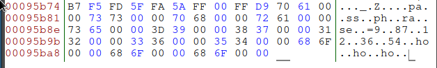

# know-your-flag
## 250 points | 26 solves

### Description
> Searching and serving the best memes
> author: deomkicer

Gagal pakai stegsolve, binwalk, foremost, lsb, msb. Buka gambar pakai bless hex editor, scroll ke bawah.  

`passphrase=987123654hohoho`

Hmm, coba gunakan passphrase ini untuk mengekstrak data dengan steghide.  
```
$ steghide extract -sf ../challenge/is-this-a-flag.jpg
Enter passphrase:
wrote extracted data to "patrick.jpg".
```

  
Cukup tidak masuk akal, coba lakukan perintah strings:
```
JFIF
rJJ2XG5BANNUWIZDJNZTS4ICIMVZGKJ3TEB4W65LSEBTGYYLHHIQGQYLDNN2G6ZDBPF5V6NDMNRPWQNDJNRPV6NLUGM4WQ2LEMVPTCZJSG5RWKM35
"%8(+(+(8U5>55>5UK[JEJ[K
j^^j
"%8(+(+(8U5>55>5UK[JEJ[K
j^^j
"1Qa
35BCSs
```

Pada bagian awal ada sesuatu yang mencurigakan, jika kita hilangkan 'r' maka string sisanya akan memenuhi syarat base32 encoding. Coba decode: 
```
$ echo JJ2XG5BANNUWIZDJNZTS4ICIMVZGKJ3TEB4W65LSEBTGYYLHHIQGQYLDNN2G6ZDBPF5V6NDMNRPWQNDJNRPV6NLUGM4WQ2LEMVPTCZJSG5RWKM35 | base32 -d
Just kidding. Here's your flag: hacktoday{_4ll_h4il__5t39hide_1e27ce3}
```

### Flag
hacktoday{_4ll_h4il__5t39hide_1e27ce3}