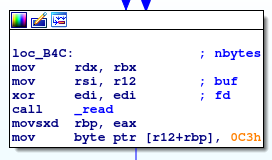

# __nullcon HackIm__ 
## _easy-shell_

## Information
**Category:** | **Points:** | **Writeup Author**
--- | --- | ---
Pwn | 451 | l0l

**Description:** 

> Go get yourself a shell while it's possible
>
> nc pwn.ctf.nullcon.net 4010
>
> [easy-shell](./easy-shell)

### easy-shell  

#### file
```
λ file easy-shell 
easy-shell: ELF 64-bit LSB shared object, x86-64, version 1 (SYSV), dynamically linked, interpreter /lib64/ld-linux-x86-64.so.2, for GNU/Linux 3.2.0, BuildID[sha1]=17078c373870713a0e05bb52fccd823edf45f158, stripped
```

#### main
  
Pada awal fungsi terlihat program mengalokasikan 0x4000 byte memory dengan proteksi 7, yang berarti `r-w-x`.  
  
Setelah itu program membaca input kita dengan `read`. `read` mereturn jumlah byte yang terbaca (dalam kasus ini maksimal 0x4000 bytes). Lalu dimasukkan ke `rbp`. Pada akhir input ditambahkan 1 byte yang benilai 0xc3 (`ret`). Sedangkan input kita sendiri disimpan pada alamat di register `r12`.  
  
Lalu untuk setiap karakter, program melakukan pengecekan dengan `__ctype_b_loc`.  
Sedikit searching tentang fungsi ini, saya dapatkan jawabannya [disini]("https://stackoverflow.com/questions/37702434/ctype-b-loc-what-is-its-purpose").  
Intinya adalah `__ctype_b_loc` melakukan pengecekan karakter berdasarkan karakteristiknya (lowercase, uppercase, dll).
Kurang lebih strukturnya 
```c
enum
{
  _ISupper = _ISbit (0),        /* UPPERCASE.  */
  _ISlower = _ISbit (1),        /* lowercase.  */
  _ISalpha = _ISbit (2),        /* Alphabetic.  */
  _ISdigit = _ISbit (3),        /* Numeric.  */
  _ISxdigit = _ISbit (4),       /* Hexadecimal numeric.  */
  _ISspace = _ISbit (5),        /* Whitespace.  */
  _ISprint = _ISbit (6),        /* Printing.  */
  _ISgraph = _ISbit (7),        /* Graphical.  */
  _ISblank = _ISbit (8),        /* Blank (usually SPC and TAB).  */
  _IScntrl = _ISbit (9),        /* Control character.  */
  _ISpunct = _ISbit (10),       /* Punctuation.  */
  _ISalnum = _ISbit (11)        /* Alphanumeric.  */
};
```
Sedikit contoh : 
```
To make an example, if you make a lookup to the table __ctype_b_loc() returns for the character whose ascii code is 0x30 ('0') you will have 0x08d8.
```

Dalam kasus kita, kode yang diberikan adalah 0xc00 ('0b110000000000') yang berarti hanya bit 10 dan 11 yang diset. Artinya kita hanya boleh memasukkan karakter alphanumeric dan punctuation.

Jika input kita lolos pengecekan maka input kita akan dieksekusi dengan perintah `call`.

Disini tujuan kita menjadi jelas :
Membuat shellcode yang hanya membutuhkan karakter alphanumeric

Dengan keyword : "x86_64 alphanumeric shellcode" ditemukan banyak sekali shell, namun tidak ada yang berhasil, sampai kompetisi selesai.

Setelah kompetisi selesai, saya baca writeup. Ternyata setelah dilakukan pengecekan `seccomp` dengan `seccomp-tools`, hasilnya:  
```
λ seccomp-tools dump ./easy-shell
 line  CODE  JT   JF      K
=================================
 0000: 0x20 0x00 0x00 0x00000004  A = arch
 0001: 0x15 0x00 0x03 0xc000003e  if (A != ARCH_X86_64) goto 0005
 0002: 0x20 0x00 0x00 0x00000000  A = sys_number
 0003: 0x15 0x01 0x00 0x0000003b  if (A == execve) goto 0005
 0004: 0x06 0x00 0x00 0x7fff0000  return ALLOW
 0005: 0x06 0x00 0x00 0x00051234  return ERRNO(4660)
```
Terlihat kita tidak boleh menggunakan `execve`. Sementara shell yang ditemukan di internet kebanyakan menggunakan `execve`.  

Note : Belum bisa bikin shell xD
b *0x0000555555554b94 -> call r12
//TODO : SOLVE IT

ref : 
- https://github.com/EmpireCTF/empirectf/blob/master/writeups/2019-02-01-nullcon-HackIM/README.md#easy-shell
- https://lordidiot.github.io/2019-02-03/nullcon-hackim-ctf-2019/#easy-shell


### Payload  


### Result  


### Flag 
